# Sabron Trip Sync v2 Fullstack Architecture Document

## Introduction

This document outlines the complete fullstack architecture for Sabron Trip Sync v2, including backend systems, frontend implementation, and their integration. It serves as the single source of truth for AI-driven development, ensuring consistency across the entire technology stack.

This unified approach combines what would traditionally be separate backend and frontend architecture documents, streamlining the development process for modern fullstack applications where these concerns are increasingly intertwined.

### Starter Template or Existing Project
N/A - Greenfield project

### Change Log
| Date | Version | Description | Author |
|------|---------|-------------|---------|
| 2025-01-21 | 1.0 | Initial architecture document | AI Assistant |

## High Level Architecture

### Technical Summary

Sabron Trip Sync v2 is a React Native mobile application built on Expo SDK 53 with a database-driven Backend-as-a-Service (BaaS) architecture using Supabase. The application leverages React Native's New Architecture for optimal performance while maintaining offline-first capabilities through MMKV local storage and vector clocks for conflict resolution. By pushing business logic to PostgreSQL functions and using Supabase's built-in Auth, Realtime, and Storage services, we eliminate serverless cold starts while maintaining scalability. The architecture achieves the PRD goals of seamless offline functionality, real-time collaboration, and sub-2 second screen loads through intelligent caching, optimistic updates, and database-level optimizations.

### Platform and Infrastructure Choice

**Platform:** Supabase (Primary) + Expo EAS (Build/Deploy)
**Key Services:** PostgreSQL, Auth, Realtime, Storage, Edge Functions (minimal)
**Deployment Host and Regions:** Supabase Cloud (US-East primary, EU-West replica for low latency)

### Repository Structure

**Structure:** Single Repository
**Monorepo Tool:** N/A - Single unified codebase
**Package Organization:** Feature-based with shared utilities

### High Level Architecture Diagram

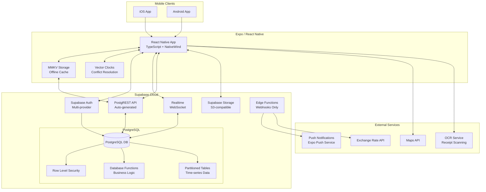

### Architectural Patterns

- **Database-Driven Architecture:** PostgreSQL functions handle business logic to avoid serverless cold starts - _Rationale:_ Eliminates cold starts while maintaining scalability and consistency
- **Offline-First with Sync:** MMKV for local storage with vector clock conflict resolution - _Rationale:_ Ensures full functionality without connectivity as per PRD requirements
- **Row Level Security (RLS):** Database-level security for multi-tenant isolation - _Rationale:_ Provides secure, performant data access without additional API logic
- **BaaS Pattern:** Leverage Supabase's managed services for auth, realtime, and storage - _Rationale:_ Reduces infrastructure complexity while maintaining enterprise capabilities
- **Component-Based UI:** Reusable React Native components with NativeWind styling - _Rationale:_ Consistent UI/UX with minimal bundle size using Tailwind utilities

## Tech Stack

### Technology Stack Table

| Category | Technology | Version | Purpose | Rationale |
|----------|------------|---------|----------|-----------|
| Frontend Language | TypeScript | 5.8.3 | Type-safe development | Industry standard for large React Native apps |
| Frontend Framework | React Native | 0.79.4 | Cross-platform mobile | Latest stable with New Architecture support |
| UI Component Library | React Native Elements + Custom | 4.0.0-rc.8 | UI components | Lightweight with good customization options |
| State Management | Zustand + TanStack Query | 5.0.5 / 5.52.1 | Local state + server state | Simple API with powerful caching capabilities |
| Backend Language | TypeScript (Edge Functions) | 5.8.3 | Webhook handlers only | Consistency with frontend codebase |
| Backend Framework | Supabase Functions | Latest | Minimal serverless functions | Only for webhooks to avoid cold starts |
| API Style | PostgREST (REST) | Auto-generated | Database API | Zero-latency API generation from schema |
| Database | PostgreSQL | 15+ | Primary datastore | Advanced features for business logic |
| Cache | MMKV | 3.1.0 | Local caching | Fastest React Native storage solution |
| File Storage | Supabase Storage | Latest | Media storage | S3-compatible with RLS integration |
| Authentication | Supabase Auth | Latest | Multi-provider auth | Built-in with RLS integration |
| Frontend Testing | Jest + React Native Testing Library | 29.7.0 / 15.0.0 | Unit/component tests | Standard React Native testing stack |
| Backend Testing | Jest + Supertest | 29.7.0 / 6.3.4 | Function tests | Minimal due to database-driven logic |
| E2E Testing | Maestro | 1.37.0 | End-to-end testing | User's explicit preference, great for React Native |
| Build Tool | Expo CLI | 53.0.0 | Build orchestration | Integrated with Expo ecosystem |
| Bundler | Metro | 0.81.0 | JavaScript bundling | Default React Native bundler |

| CI/CD | GitHub Actions + EAS Build | Latest | Automated deployment | Native integration with Expo |
| Monitoring | Sentry | 8.32.0 | Error tracking | React Native specific features |
| Logging | Flipper + Custom | 0.260.0 | Debug logging | Development and production insights |
| CSS Framework | NativeWind | 4.1.23 | Styling | TailwindCSS for React Native |

## Data Models

### User
**Purpose:** Core user entity for authentication and profile management

**Key Attributes:**
- id: UUID - Unique identifier from Supabase Auth
- email: string - Primary email address
- fullName: string - Display name
- avatar: string? - Profile picture URL
- preferences: UserPreferences - User settings
- createdAt: timestamp - Account creation date

**TypeScript Interface:**
```typescript
interface User {
  id: string;
  email: string;
  fullName: string;
  avatar?: string;
  preferences: UserPreferences;
  createdAt: Date;
}

interface UserPreferences {
  currency: string;
  language: string;
  notifications: NotificationSettings;
  theme: 'light' | 'dark' | 'system';
}
```

**Relationships:**
- Has many TripMembers
- Has many Expenses (as payer)
- Has many Activities

### Trip
**Purpose:** Container for travel plans with multi-user collaboration

**Key Attributes:**
- id: UUID - Unique identifier
- name: string - Trip title
- startDate: Date - Trip start
- endDate: Date - Trip end
- status: TripStatus - Current state
- coverImage?: string - Header image
- settings: TripSettings - Trip configuration

**TypeScript Interface:**
```typescript
interface Trip {
  id: string;
  name: string;
  startDate: Date;
  endDate: Date;
  status: 'planning' | 'active' | 'completed' | 'cancelled';
  coverImage?: string;
  settings: TripSettings;
  createdAt: Date;
  updatedAt: Date;
}

interface TripSettings {
  currency: string;
  timezone: string;
  visibility: 'private' | 'shared';
  splitMethod: 'equal' | 'percentage' | 'shares' | 'exact';
}
```

**Relationships:**
- Has many TripMembers
- Has many Expenses
- Has many Activities
- Has many Destinations

### Expense
**Purpose:** Track shared expenses with splitting logic

**Key Attributes:**
- id: UUID - Unique identifier
- tripId: UUID - Associated trip
- paidBy: UUID - User who paid
- amount: number - Total amount
- currency: string - Currency code
- category: ExpenseCategory - Type of expense
- splits: ExpenseSplit[] - How to divide

**TypeScript Interface:**
```typescript
interface Expense {
  id: string;
  tripId: string;
  paidBy: string;
  amount: number;
  currency: string;
  category: ExpenseCategory;
  description: string;
  receipt?: string;
  date: Date;
  splits: ExpenseSplit[];
  createdAt: Date;
  updatedAt: Date;
  vectorClock: VectorClock;
}

interface ExpenseSplit {
  userId: string;
  amount: number;
  percentage?: number;
  shares?: number;
  settled: boolean;
}

type ExpenseCategory = 
  | 'accommodation' 
  | 'transport' 
  | 'food' 
  | 'activities' 
  | 'shopping' 
  | 'other';
```

**Relationships:**
- Belongs to Trip
- Belongs to User (paidBy)
- Has many ExpenseSplits

### Activity
**Purpose:** Itinerary items and bookings

**Key Attributes:**
- id: UUID - Unique identifier
- tripId: UUID - Associated trip
- name: string - Activity title
- type: ActivityType - Category
- startTime: Date - Start date/time
- endTime?: Date - End date/time
- location?: Location - Geographic data

**TypeScript Interface:**
```typescript
interface Activity {
  id: string;
  tripId: string;
  destinationId?: string;
  name: string;
  type: ActivityType;
  description?: string;
  startTime: Date;
  endTime?: Date;
  location?: Location;
  bookingReference?: string;
  cost?: Money;
  documents?: string[];
  createdAt: Date;
  updatedAt: Date;
  vectorClock: VectorClock;
}

type ActivityType = 
  | 'flight' 
  | 'accommodation' 
  | 'transport' 
  | 'tour' 
  | 'restaurant' 
  | 'attraction' 
  | 'custom';

interface Location {
  latitude: number;
  longitude: number;
  address?: string;
  placeId?: string;
}
```

**Relationships:**
- Belongs to Trip
- Belongs to Destination (optional)
- Created by User

## API Specification

### REST API Specification

```yaml
openapi: 3.0.0
info:
  title: Sabron Trip Sync API
  version: 1.0.0
  description: Auto-generated PostgREST API for Trip Sync v2
servers:
  - url: https://your-project.supabase.co/rest/v1
    description: Supabase PostgREST API

paths:
  /trips:
    get:
      summary: List user's trips
      parameters:
        - name: select
          in: query
          schema:
            type: string
          example: "*,trip_members(user:users(*))"
        - name: trip_members.user_id
          in: query
          schema:
            type: string
          example: eq.{user_id}
      security:
        - BearerAuth: []
    post:
      summary: Create new trip
      requestBody:
        content:
          application/json:
            schema:
              $ref: '#/components/schemas/TripInput'
      security:
        - BearerAuth: []
  
  /expenses:
    get:
      summary: List expenses for a trip
      parameters:
        - name: trip_id
          in: query
          required: true
          schema:
            type: string
        - name: select
          in: query
          schema:
            type: string
          example: "*,user:users(*),splits:expense_splits(*)"
      security:
        - BearerAuth: []
    post:
      summary: Create expense
      requestBody:
        content:
          application/json:
            schema:
              $ref: '#/components/schemas/ExpenseInput'
      security:
        - BearerAuth: []
  
  /rpc/calculate_trip_balances:
    post:
      summary: Calculate current balances for trip
      requestBody:
        content:
          application/json:
            schema:
              type: object
              properties:
                p_trip_id:
                  type: string
                  format: uuid
      security:
        - BearerAuth: []

components:
  securitySchemes:
    BearerAuth:
      type: http
      scheme: bearer
      bearerFormat: JWT
  
  schemas:
    TripInput:
      type: object
      required: [name, start_date, end_date]
      properties:
        name:
          type: string
        start_date:
          type: string
          format: date
        end_date:
          type: string
          format: date
        settings:
          type: object
    
    ExpenseInput:
      type: object
      required: [trip_id, amount, currency, category]
      properties:
        trip_id:
          type: string
          format: uuid
        amount:
          type: number
        currency:
          type: string
        category:
          type: string
        description:
          type: string
```

## Components

### Mobile Application Shell
**Responsibility:** Root component managing navigation, authentication state, and offline sync orchestration

**Key Interfaces:**
- Navigation container with deep linking support
- Global error boundary for crash recovery
- Network state monitoring for sync triggers
- Background task registration for sync

**Dependencies:** Expo Router, React Native NetInfo, expo-background-fetch

**Technology Stack:** React Native 0.79.4, TypeScript 5.8.3, Expo SDK 53

### Authentication Service
**Responsibility:** Handle multi-provider authentication, session management, and biometric unlock

**Key Interfaces:**
- `signIn(method: 'email' | 'google' | 'apple' | 'magic-link')`
- `signOut()`
- `refreshSession()`
- `enableBiometric()`

**Dependencies:** Supabase Auth, expo-local-authentication, expo-secure-store

**Technology Stack:** Supabase Auth SDK, React Native Keychain

### Offline Sync Engine
**Responsibility:** Manage local storage, conflict resolution, and background synchronization

**Key Interfaces:**
- `saveOffline(table: string, data: any)`
- `syncWithServer()`
- `resolveConflicts(conflicts: Conflict[])`
- `getOfflineQueue()`

**Dependencies:** MMKV Storage, NetInfo, Vector Clock implementation

**Technology Stack:** react-native-mmkv 3.1.0, custom vector clock algorithm

### Trip Management Module
**Responsibility:** Handle trip CRUD operations, member management, and real-time updates

**Key Interfaces:**
- `createTrip(trip: TripInput)`
- `inviteMember(tripId: string, email: string)`
- `subscribeToTripUpdates(tripId: string)`
- `archiveTrip(tripId: string)`

**Dependencies:** Supabase Realtime, PostgREST client, Share API

**Technology Stack:** Supabase JS Client, React Native Share

### Expense Tracking Module
**Responsibility:** Manage expense entry, splitting algorithms, and settlement calculations

**Key Interfaces:**
- `addExpense(expense: ExpenseInput)`
- `calculateSplits(amount: number, method: SplitMethod, participants: string[])`
- `getBalances(tripId: string)`
- `markAsSettled(expenseId: string, userId: string)`

**Dependencies:** Database functions, OCR service integration

**Technology Stack:** PostgreSQL functions, react-native-vision-camera

### UI Component Library
**Responsibility:** Provide consistent, accessible, and performant UI components

**Key Interfaces:**
- Core components (Button, Input, Card, Modal)
- Trip-specific components (ExpenseCard, TripTimeline, MemberAvatar)
- Layout components (Screen, Header, TabBar)
- Form components with validation

**Dependencies:** NativeWind, React Native Elements, react-hook-form

**Technology Stack:** NativeWind 4.1.23, React Native Gesture Handler

### Component Diagrams

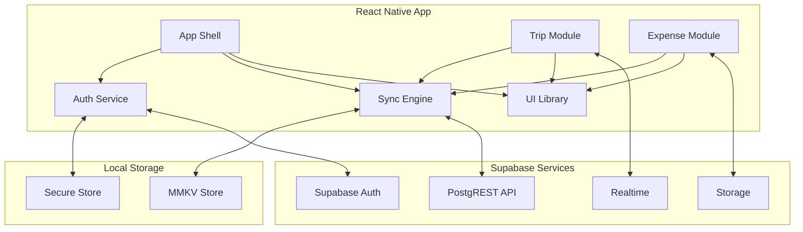

## External APIs

### Expo Push Service API
- **Purpose:** Send push notifications for trip invites and expense updates
- **Documentation:** https://docs.expo.dev/push-notifications/overview/
- **Base URL(s):** https://exp.host/--/api/v2/push/send
- **Authentication:** Expo access token
- **Rate Limits:** 600 notifications/second

**Key Endpoints Used:**
- `POST /push/send` - Send single or batch notifications

**Integration Notes:** Notifications sent via Edge Functions to avoid client-side token exposure

### OpenStreetMap Nominatim API
- **Purpose:** Geocoding and reverse geocoding for activity locations
- **Documentation:** https://nominatim.org/release-docs/latest/
- **Base URL(s):** https://nominatim.openstreetmap.org
- **Authentication:** None (respect usage policy)
- **Rate Limits:** 1 request/second

**Key Endpoints Used:**
- `GET /search` - Search locations by name
- `GET /reverse` - Get address from coordinates

**Integration Notes:** Implement client-side rate limiting and caching

### Exchange Rate API
- **Purpose:** Real-time currency conversion for multi-currency trips
- **Documentation:** https://exchangeratesapi.io/documentation/
- **Base URL(s):** https://api.exchangeratesapi.io/v1/
- **Authentication:** API key in query parameter
- **Rate Limits:** 1000 requests/month (free tier)

**Key Endpoints Used:**
- `GET /latest` - Get latest exchange rates
- `GET /convert` - Direct currency conversion

**Integration Notes:** Cache rates for 1 hour, update via Edge Function daily

### Google ML Kit Text Recognition (On-Device)
- **Purpose:** OCR for receipt scanning
- **Documentation:** https://developers.google.com/ml-kit/vision/text-recognition
- **Base URL(s):** N/A - On-device processing
- **Authentication:** N/A - Bundled with app
- **Rate Limits:** Device performance dependent

**Key Endpoints Used:**
- Local API via react-native-mlkit

**Integration Notes:** Process images locally before uploading to save bandwidth

## Core Workflows

### User Authentication Flow
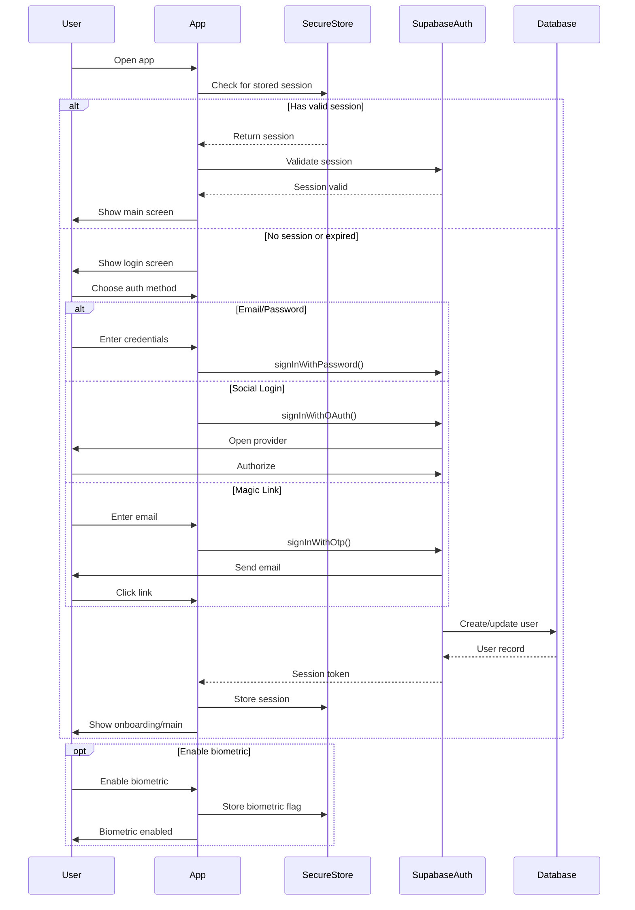

### Offline-First Expense Creation
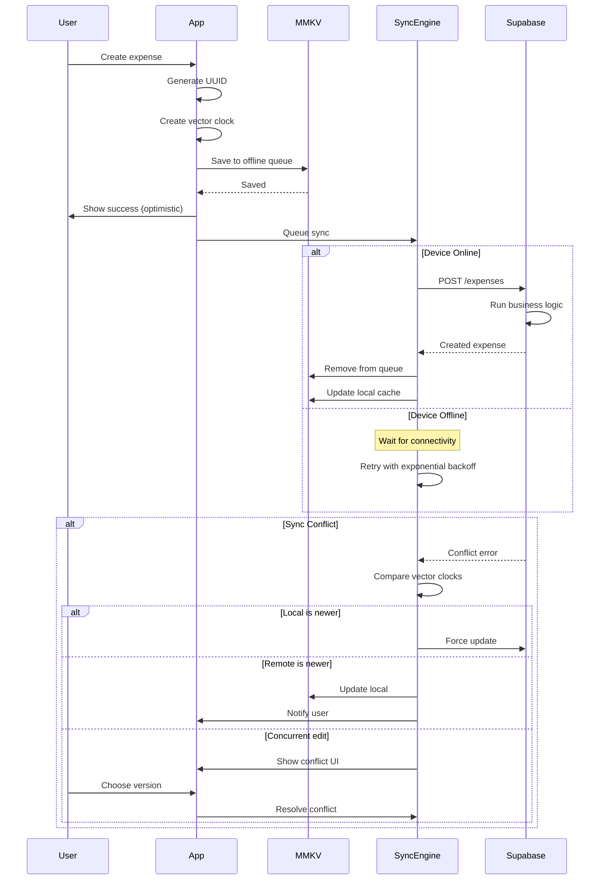

### Real-time Trip Collaboration
```mermaid
sequenceDiagram
    participant User1
    participant App1
    participant Realtime
    participant Database
    participant App2
    participant User2
    
    User1->>App1: Update trip details
    App1->>Database: UPDATE trips
    Database-->>App1: Confirmed
    
    Database->>Realtime: Broadcast change
    
    Realtime->>App2: Push update
    App2->>App2: Update local state
    App2->>User2: Show changes
    
    par Expense added
        User2->>App2: Add expense
        App2->>Database: INSERT expense
        Database->>Realtime: Broadcast
        Realtime->>App1: Push update
        App1->>User1: Show new expense
    and Member joined
        User2->>App2: Accept invite
        App2->>Database: UPDATE trip_members
        Database->>Realtime: Broadcast
        Realtime->>App1: Member joined
        App1->>User1: Update member list
    end
    
    Note over Realtime: Presence tracking
    App1->>Realtime: User1 active
    App2->>Realtime: User2 active
    Realtime->>App1,App2: Broadcast presence
```

### Mobile-Specific: Quick Add with Shortcuts
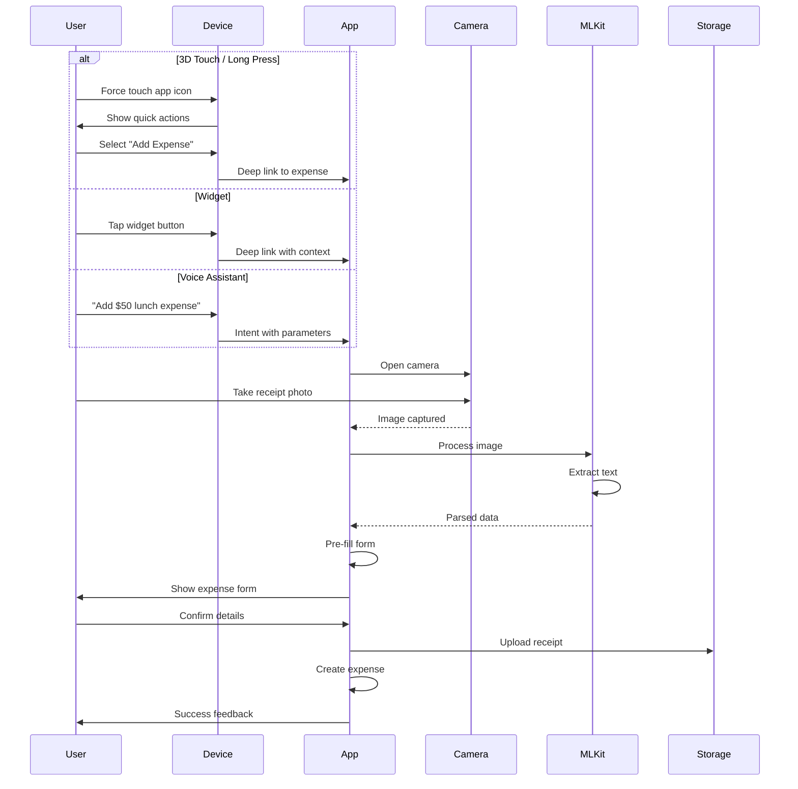

### Trip Activity Timeline View
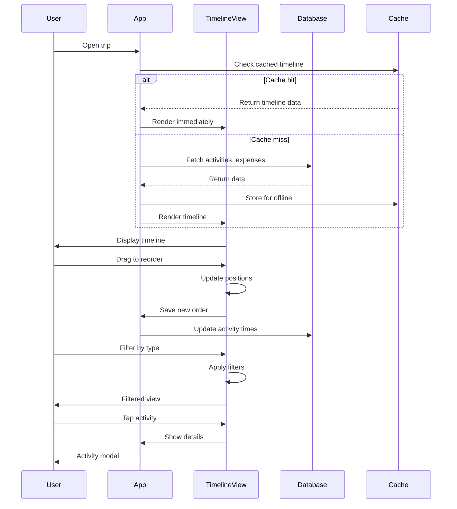

### Smart Expense Splitting
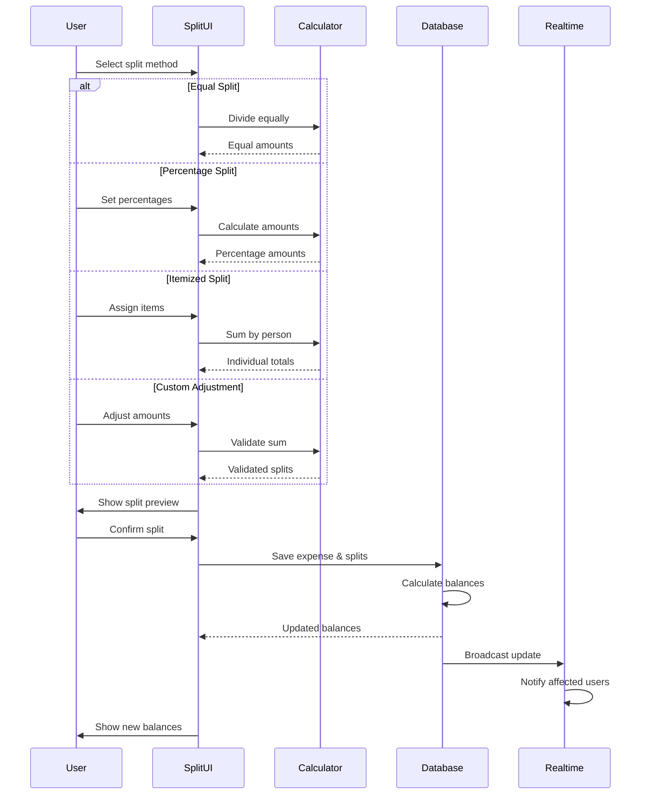

### Share Trip & Export
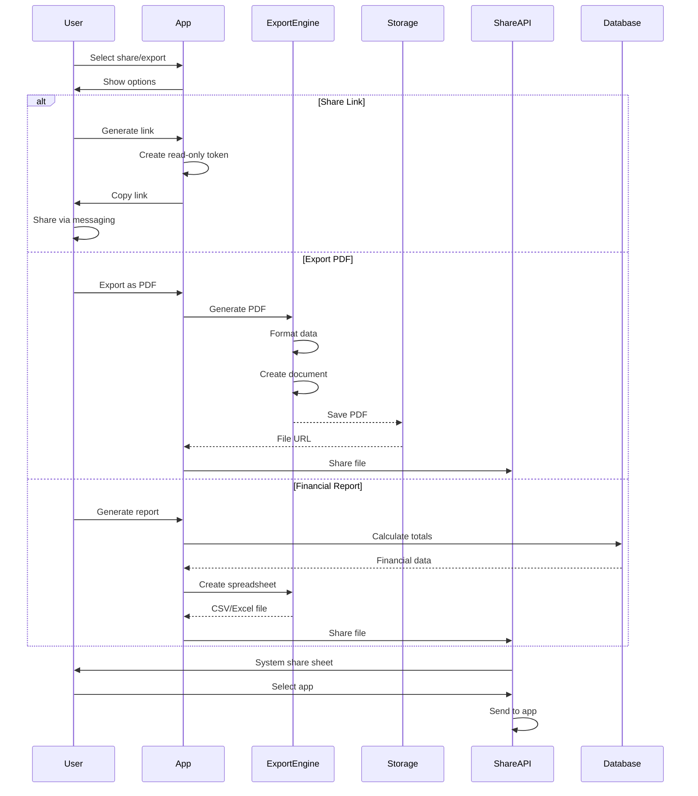

### Quick Trip Templates
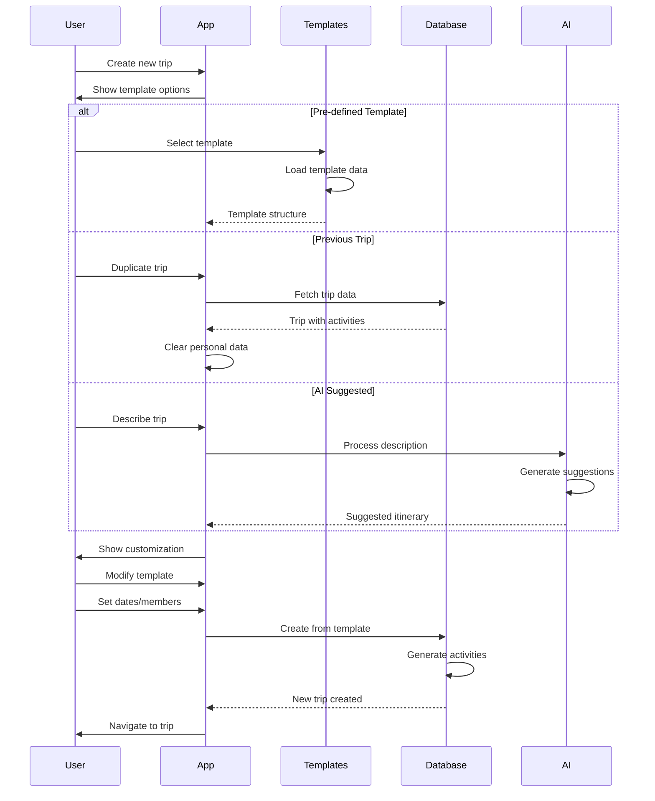

### Accessibility Navigation
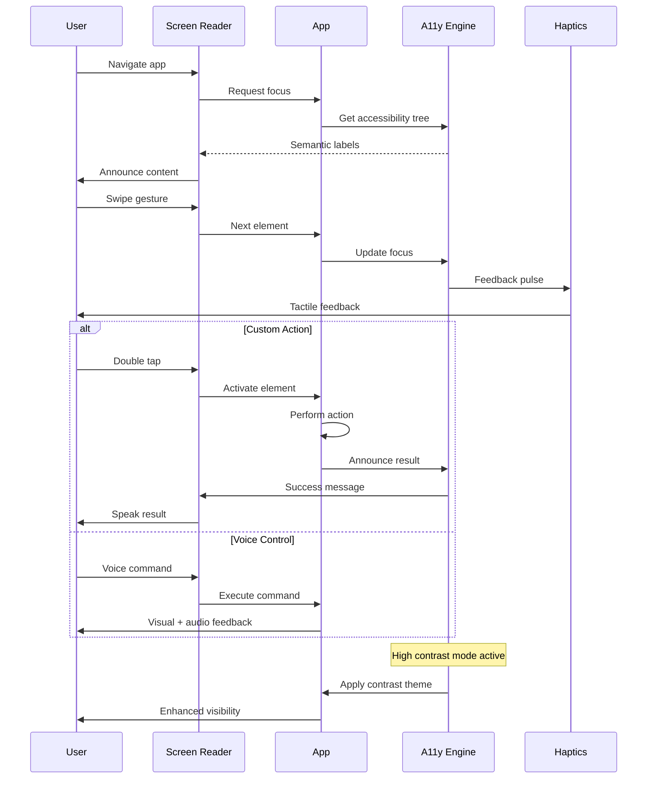

## Database Schema

```sql
-- Enable necessary extensions
CREATE EXTENSION IF NOT EXISTS "uuid-ossp";
CREATE EXTENSION IF NOT EXISTS "pg_trgm" FOR SCHEMA public;

-- User profiles (extends Supabase auth.users)
CREATE TABLE public.user_profiles (
    id UUID PRIMARY KEY REFERENCES auth.users(id) ON DELETE CASCADE,
    email TEXT NOT NULL,
    full_name TEXT NOT NULL,
    avatar_url TEXT,
    preferences JSONB DEFAULT '{
        "currency": "USD",
        "language": "en",
        "theme": "system",
        "notifications": {
            "push": true,
            "email": true,
            "trip_updates": true,
            "expense_updates": true
        }
    }'::jsonb,
    push_token TEXT,
    created_at TIMESTAMPTZ DEFAULT NOW(),
    updated_at TIMESTAMPTZ DEFAULT NOW()
);

-- Trips table
CREATE TABLE public.trips (
    id UUID PRIMARY KEY DEFAULT uuid_generate_v4(),
    name TEXT NOT NULL,
    description TEXT,
    start_date DATE NOT NULL,
    end_date DATE NOT NULL,
    status TEXT DEFAULT 'planning' CHECK (status IN ('planning', 'active', 'completed', 'cancelled')),
    cover_image_url TEXT,
    settings JSONB DEFAULT '{
        "currency": "USD",
        "timezone": "UTC",
        "visibility": "private",
        "split_method": "equal"
    }'::jsonb,
    created_by UUID NOT NULL REFERENCES public.user_profiles(id),
    created_at TIMESTAMPTZ DEFAULT NOW(),
    updated_at TIMESTAMPTZ DEFAULT NOW(),
    vector_clock JSONB DEFAULT '{}'::jsonb
);

-- Trip members (many-to-many)
CREATE TABLE public.trip_members (
    trip_id UUID NOT NULL REFERENCES public.trips(id) ON DELETE CASCADE,
    user_id UUID NOT NULL REFERENCES public.user_profiles(id) ON DELETE CASCADE,
    role TEXT DEFAULT 'member' CHECK (role IN ('admin', 'editor', 'viewer', 'member')),
    joined_at TIMESTAMPTZ DEFAULT NOW(),
    invited_by UUID REFERENCES public.user_profiles(id),
    invited_at TIMESTAMPTZ,
    accepted_at TIMESTAMPTZ,
    PRIMARY KEY (trip_id, user_id)
);

-- Destinations within trips
CREATE TABLE public.destinations (
    id UUID PRIMARY KEY DEFAULT uuid_generate_v4(),
    trip_id UUID NOT NULL REFERENCES public.trips(id) ON DELETE CASCADE,
    name TEXT NOT NULL,
    country TEXT,
    arrival_date DATE,
    departure_date DATE,
    latitude DECIMAL(10, 8),
    longitude DECIMAL(11, 8),
    place_id TEXT,
    order_index INTEGER DEFAULT 0,
    created_at TIMESTAMPTZ DEFAULT NOW(),
    updated_at TIMESTAMPTZ DEFAULT NOW()
);

-- Expenses table with partitioning for performance
CREATE TABLE public.expenses (
    id UUID DEFAULT uuid_generate_v4(),
    trip_id UUID NOT NULL,
    paid_by_user_id UUID NOT NULL REFERENCES public.user_profiles(id),
    amount DECIMAL(10,2) NOT NULL CHECK (amount > 0),
    currency TEXT NOT NULL,
    category TEXT NOT NULL CHECK (category IN ('accommodation', 'transport', 'food', 'activities', 'shopping', 'other')),
    description TEXT NOT NULL,
    receipt_url TEXT,
    date DATE NOT NULL,
    created_at TIMESTAMPTZ NOT NULL DEFAULT NOW(),
    updated_at TIMESTAMPTZ DEFAULT NOW(),
    vector_clock JSONB DEFAULT '{}'::jsonb,
    PRIMARY KEY (id, created_at)
) PARTITION BY RANGE (created_at);

-- Create partitions for expenses (monthly)
CREATE TABLE public.expenses_2025_01 PARTITION OF public.expenses
    FOR VALUES FROM ('2025-01-01') TO ('2025-02-01');
CREATE TABLE public.expenses_2025_02 PARTITION OF public.expenses
    FOR VALUES FROM ('2025-02-01') TO ('2025-03-01');
-- Continue creating partitions as needed...

-- Foreign key for partitioned table
ALTER TABLE public.expenses ADD CONSTRAINT expenses_trip_fkey 
    FOREIGN KEY (trip_id) REFERENCES public.trips(id) ON DELETE CASCADE;

-- Expense splits
CREATE TABLE public.expense_splits (
    id UUID PRIMARY KEY DEFAULT uuid_generate_v4(),
    expense_id UUID NOT NULL,
    user_id UUID NOT NULL REFERENCES public.user_profiles(id),
    amount DECIMAL(10,2) NOT NULL,
    percentage DECIMAL(5,2),
    shares INTEGER,
    is_settled BOOLEAN DEFAULT FALSE,
    settled_at TIMESTAMPTZ,
    created_at TIMESTAMPTZ DEFAULT NOW()
);

-- Activities/Itinerary items
CREATE TABLE public.activities (
    id UUID PRIMARY KEY DEFAULT uuid_generate_v4(),
    trip_id UUID NOT NULL REFERENCES public.trips(id) ON DELETE CASCADE,
    destination_id UUID REFERENCES public.destinations(id) ON DELETE SET NULL,
    name TEXT NOT NULL,
    type TEXT NOT NULL CHECK (type IN ('flight', 'accommodation', 'transport', 'tour', 'restaurant', 'attraction', 'custom')),
    description TEXT,
    start_time TIMESTAMPTZ NOT NULL,
    end_time TIMESTAMPTZ,
    location JSONB,
    booking_reference TEXT,
    booking_url TEXT,
    cost JSONB,
    documents JSONB DEFAULT '[]'::jsonb,
    created_by UUID NOT NULL REFERENCES public.user_profiles(id),
    created_at TIMESTAMPTZ DEFAULT NOW(),
    updated_at TIMESTAMPTZ DEFAULT NOW(),
    vector_clock JSONB DEFAULT '{}'::jsonb
);

-- Indexes for performance
CREATE INDEX idx_trips_dates ON public.trips(start_date, end_date);
CREATE INDEX idx_trips_created_by ON public.trips(created_by);
CREATE INDEX idx_trip_members_user ON public.trip_members(user_id);
CREATE INDEX idx_expenses_trip_date ON public.expenses(trip_id, date);
CREATE INDEX idx_expenses_paid_by ON public.expenses(paid_by_user_id);
CREATE INDEX idx_expense_splits_expense ON public.expense_splits(expense_id);
CREATE INDEX idx_expense_splits_user ON public.expense_splits(user_id);
CREATE INDEX idx_activities_trip ON public.activities(trip_id);
CREATE INDEX idx_activities_start_time ON public.activities(start_time);

-- Full text search indexes
CREATE INDEX idx_trips_search ON public.trips USING gin(to_tsvector('english', name || ' ' || COALESCE(description, '')));
CREATE INDEX idx_activities_search ON public.activities USING gin(to_tsvector('english', name || ' ' || COALESCE(description, '')));

-- Row Level Security Policies
ALTER TABLE public.user_profiles ENABLE ROW LEVEL SECURITY;
ALTER TABLE public.trips ENABLE ROW LEVEL SECURITY;
ALTER TABLE public.trip_members ENABLE ROW LEVEL SECURITY;
ALTER TABLE public.expenses ENABLE ROW LEVEL SECURITY;
ALTER TABLE public.expense_splits ENABLE ROW LEVEL SECURITY;
ALTER TABLE public.activities ENABLE ROW LEVEL SECURITY;
ALTER TABLE public.destinations ENABLE ROW LEVEL SECURITY;

-- User profiles: Users can read all profiles but only update their own
CREATE POLICY "Users can read all profiles"
    ON public.user_profiles FOR SELECT
    USING (true);

CREATE POLICY "Users can update own profile"
    ON public.user_profiles FOR UPDATE
    USING (auth.uid() = id);

-- Trips: Users can only see trips they're members of
CREATE POLICY "Users can view their trips"
    ON public.trips FOR SELECT
    USING (
        auth.uid() IN (
            SELECT user_id FROM public.trip_members
            WHERE trip_id = trips.id
        )
    );

CREATE POLICY "Trip creators and admins can update"
    ON public.trips FOR UPDATE
    USING (
        auth.uid() = created_by OR
        auth.uid() IN (
            SELECT user_id FROM public.trip_members
            WHERE trip_id = trips.id AND role = 'admin'
        )
    );

-- Trip members: Viewable by trip members
CREATE POLICY "Trip members can view members"
    ON public.trip_members FOR SELECT
    USING (
        auth.uid() IN (
            SELECT user_id FROM public.trip_members tm
            WHERE tm.trip_id = trip_members.trip_id
        )
    );

-- Expenses: Viewable by trip members
CREATE POLICY "Trip members can view expenses"
    ON public.expenses FOR SELECT
    USING (
        auth.uid() IN (
            SELECT user_id FROM public.trip_members
            WHERE trip_id = expenses.trip_id
        )
    );

CREATE POLICY "Trip members can create expenses"
    ON public.expenses FOR INSERT
    WITH CHECK (
        auth.uid() IN (
            SELECT user_id FROM public.trip_members
            WHERE trip_id = expenses.trip_id
        )
    );

-- Database Functions
CREATE OR REPLACE FUNCTION public.calculate_trip_balances(p_trip_id UUID)
RETURNS TABLE(
    user_id UUID,
    total_paid DECIMAL(10,2),
    total_owed DECIMAL(10,2),
    balance DECIMAL(10,2),
    currency TEXT
) AS $$
BEGIN
    RETURN QUERY
    WITH trip_currency AS (
        SELECT settings->>'currency' as currency
        FROM public.trips
        WHERE id = p_trip_id
    ),
    user_payments AS (
        SELECT 
            e.paid_by_user_id as user_id,
            SUM(e.amount) as total_paid
        FROM public.expenses e
        WHERE e.trip_id = p_trip_id
        GROUP BY e.paid_by_user_id
    ),
    user_owes AS (
        SELECT 
            es.user_id,
            SUM(es.amount) as total_owed
        FROM public.expense_splits es
        JOIN public.expenses e ON es.expense_id = e.id
        WHERE e.trip_id = p_trip_id
        GROUP BY es.user_id
    )
    SELECT 
        COALESCE(up.user_id, uo.user_id) as user_id,
        COALESCE(up.total_paid, 0) as total_paid,
        COALESCE(uo.total_owed, 0) as total_owed,
        COALESCE(up.total_paid, 0) - COALESCE(uo.total_owed, 0) as balance,
        tc.currency
    FROM user_payments up
    FULL OUTER JOIN user_owes uo ON up.user_id = uo.user_id
    CROSS JOIN trip_currency tc;
END;
$$ LANGUAGE plpgsql SECURITY DEFINER;

-- Trigger for updated_at
CREATE OR REPLACE FUNCTION public.update_updated_at_column()
RETURNS TRIGGER AS $$
BEGIN
    NEW.updated_at = NOW();
    RETURN NEW;
END;
$$ language plpgsql;

CREATE TRIGGER update_trips_updated_at BEFORE UPDATE ON public.trips
    FOR EACH ROW EXECUTE PROCEDURE public.update_updated_at_column();
CREATE TRIGGER update_activities_updated_at BEFORE UPDATE ON public.activities
    FOR EACH ROW EXECUTE PROCEDURE public.update_updated_at_column();
CREATE TRIGGER update_expenses_updated_at BEFORE UPDATE ON public.expenses
    FOR EACH ROW EXECUTE PROCEDURE public.update_updated_at_column();

-- Realtime publication
ALTER PUBLICATION supabase_realtime ADD TABLE public.trips;
ALTER PUBLICATION supabase_realtime ADD TABLE public.expenses;
ALTER PUBLICATION supabase_realtime ADD TABLE public.activities;
ALTER PUBLICATION supabase_realtime ADD TABLE public.trip_members;
```

## Frontend Architecture

### Component Architecture

#### Component Organization
```text
src/
├── components/
│   ├── common/              # Shared UI components
│   │   ├── Button.tsx
│   │   ├── Input.tsx
│   │   ├── Card.tsx
│   │   └── Modal.tsx
│   ├── trip/               # Trip-specific components
│   │   ├── TripCard.tsx
│   │   ├── TripTimeline.tsx
│   │   └── TripMemberList.tsx
│   ├── expense/            # Expense components
│   │   ├── ExpenseForm.tsx
│   │   ├── ExpenseCard.tsx
│   │   └── SplitCalculator.tsx
│   └── layout/             # Layout components
│       ├── Screen.tsx
│       ├── Header.tsx
│       └── TabBar.tsx
├── hooks/                  # Custom React hooks
│   ├── useAuth.ts
│   ├── useOfflineSync.ts
│   └── useTrip.ts
├── services/              # API and external services
│   ├── supabase.ts
│   ├── storage.ts
│   └── sync.ts
└── stores/                # Zustand stores
    ├── authStore.ts
    ├── tripStore.ts
    └── syncStore.ts
```

#### Component Template
```typescript
import React, { memo } from 'react';
import { View, Text, Pressable } from 'react-native';
import { styled } from 'nativewind';
import { useHapticFeedback } from '@/hooks/useHapticFeedback';

interface TripCardProps {
  trip: Trip;
  onPress: (trip: Trip) => void;
  testID?: string;
}

const StyledView = styled(View);
const StyledText = styled(Text);
const StyledPressable = styled(Pressable);

export const TripCard = memo<TripCardProps>(({ trip, onPress, testID }) => {
  const { trigger } = useHapticFeedback();

  const handlePress = () => {
    trigger('impactLight');
    onPress(trip);
  };

  return (
    <StyledPressable
      onPress={handlePress}
      testID={testID}
      className="bg-white dark:bg-gray-800 p-4 rounded-lg shadow-md mb-3"
      accessibilityLabel={`Trip to ${trip.name}`}
      accessibilityRole="button"
    >
      <StyledView className="flex-row justify-between items-start">
        <StyledView className="flex-1">
          <StyledText className="text-lg font-semibold text-gray-900 dark:text-white">
            {trip.name}
          </StyledText>
          <StyledText className="text-sm text-gray-600 dark:text-gray-400 mt-1">
            {formatDateRange(trip.startDate, trip.endDate)}
          </StyledText>
        </StyledView>
        {trip.memberCount && (
          <StyledView className="bg-blue-100 dark:bg-blue-900 px-2 py-1 rounded">
            <StyledText className="text-xs text-blue-800 dark:text-blue-200">
              {trip.memberCount} members
            </StyledText>
          </StyledView>
        )}
      </StyledView>
    </StyledPressable>
  );
});

TripCard.displayName = 'TripCard';
```

### State Management Architecture

#### State Structure
```typescript
// stores/types.ts
interface AppState {
  // Auth State
  auth: {
    user: User | null;
    session: Session | null;
    isLoading: boolean;
    error: string | null;
  };
  
  // Trip State
  trips: {
    items: Trip[];
    currentTrip: Trip | null;
    isLoading: boolean;
    error: string | null;
  };
  
  // Expense State
  expenses: {
    byTripId: Record<string, Expense[]>;
    isLoading: boolean;
    error: string | null;
  };
  
  // Sync State
  sync: {
    pendingOperations: SyncOperation[];
    lastSyncTime: Date | null;
    isSyncing: boolean;
    conflicts: Conflict[];
  };
}
```

#### State Management Patterns
- **Zustand for Local State**: Auth, UI state, offline queue
- **TanStack Query for Server State**: Trips, expenses, activities with caching
- **MMKV for Persistence**: Offline data and user preferences
- **Optimistic Updates**: Immediate UI updates with rollback on failure
- **Subscription Management**: Real-time updates via Supabase Realtime

### Routing Architecture

#### Route Organization
```text
app/
├── (auth)/
│   ├── _layout.tsx         # Auth layout wrapper
│   ├── sign-in.tsx         # Sign in screen
│   ├── sign-up.tsx         # Sign up screen
│   └── forgot-password.tsx # Password reset
├── (app)/
│   ├── _layout.tsx         # Main app layout with tabs
│   ├── (tabs)/
│   │   ├── _layout.tsx     # Tab navigator
│   │   ├── trips/
│   │   │   ├── index.tsx   # Trips list
│   │   │   └── [id].tsx    # Trip details
│   │   ├── expenses.tsx    # Expenses overview
│   │   └── profile.tsx     # User profile
│   └── modal/
│       ├── add-expense.tsx  # Add expense modal
│       └── add-trip.tsx     # Create trip modal
└── _layout.tsx             # Root layout
```

#### Protected Route Pattern
```typescript
// app/(app)/_layout.tsx
import { useAuth } from '@/hooks/useAuth';
import { Redirect, Stack } from 'expo-router';
import { SplashScreen } from '@/components/SplashScreen';

export default function AppLayout() {
  const { user, isLoading } = useAuth();

  if (isLoading) {
    return <SplashScreen />;
  }

  if (!user) {
    return <Redirect href="/sign-in" />;
  }

  return (
    <Stack
      screenOptions={{
        headerShown: false,
        animation: 'slide_from_right',
      }}
    />
  );
}
```

### Frontend Services Layer

#### API Client Setup
```typescript
// services/api.ts
import { createClient } from '@supabase/supabase-js';
import AsyncStorage from '@react-native-async-storage/async-storage';
import { MMKV } from 'react-native-mmkv';

const storage = new MMKV();

const supabase = createClient(
  process.env.EXPO_PUBLIC_SUPABASE_URL!,
  process.env.EXPO_PUBLIC_SUPABASE_ANON_KEY!,
  {
    auth: {
      storage: {
        async getItem(key: string) {
          return storage.getString(key) || null;
        },
        async setItem(key: string, value: string) {
          storage.set(key, value);
        },
        async removeItem(key: string) {
          storage.delete(key);
        },
      },
      autoRefreshToken: true,
      persistSession: true,
      detectSessionInUrl: false,
    },
  }
);

// Add request/response interceptors for offline support
supabase.auth.onAuthStateChange((event, session) => {
  if (event === 'TOKEN_REFRESHED') {
    // Update stored session
    storage.set('supabase.auth.token', JSON.stringify(session));
  }
});

export { supabase };
```

#### Service Example
```typescript
// services/trips.ts
import { supabase } from './api';
import { syncStore } from '@/stores/syncStore';
import { Trip, TripInput } from '@/types';

export const tripService = {
  async getTrips(): Promise<Trip[]> {
    const { data, error } = await supabase
      .from('trips')
      .select(`
        *,
        trip_members!inner(
          user:user_profiles(*)
        )
      `)
      .order('start_date', { ascending: false });

    if (error) throw error;
    return data;
  },

  async createTrip(input: TripInput): Promise<Trip> {
    // Optimistic update
    const tempId = `temp_${Date.now()}`;
    const optimisticTrip = { ...input, id: tempId };
    
    // Add to sync queue if offline
    if (!navigator.onLine) {
      syncStore.addOperation({
        type: 'CREATE_TRIP',
        data: optimisticTrip,
        timestamp: new Date(),
      });
      return optimisticTrip as Trip;
    }

    const { data, error } = await supabase
      .from('trips')
      .insert(input)
      .select()
      .single();

    if (error) throw error;
    return data;
  },

  subscribeToTrip(tripId: string, callback: (trip: Trip) => void) {
    return supabase
      .channel(`trip:${tripId}`)
      .on(
        'postgres_changes',
        { event: '*', schema: 'public', table: 'trips', filter: `id=eq.${tripId}` },
        (payload) => callback(payload.new as Trip)
      )
      .subscribe();
  },
};
```

## Backend Architecture

### Service Architecture

#### Database-Driven Architecture
```text
Supabase Backend Structure:
├── PostgreSQL Database
│   ├── Tables with RLS
│   ├── Database Functions (Business Logic)
│   ├── Triggers for automation
│   └── Materialized Views for performance
├── PostgREST API (Auto-generated)
├── Realtime Engine
├── Auth Service
├── Storage Service
└── Edge Functions (Minimal)
    ├── webhooks/
    │   └── push-notifications.ts
    └── scheduled/
        └── exchange-rates.ts
```

### Database Architecture

#### Schema Design
```sql
-- Advanced RLS Policies with hierarchical permissions
CREATE POLICY "Trip members can view based on role"
    ON trips FOR SELECT
    USING (
        auth.uid() IN (
            SELECT user_id FROM trip_members
            WHERE trip_id = trips.id
            AND (
                -- Viewers can see basic info
                role = 'viewer' OR
                -- Members can see everything
                role IN ('member', 'editor', 'admin')
            )
            AND accepted_at IS NOT NULL
        )
    );

CREATE POLICY "Trip members can update based on role"
    ON trips FOR UPDATE
    USING (
        auth.uid() IN (
            SELECT user_id FROM trip_members
            WHERE trip_id = trips.id
            AND role IN ('admin', 'editor')
            AND accepted_at IS NOT NULL
        )
    );

-- Materialized views for analytics
CREATE MATERIALIZED VIEW trip_expense_summary AS
SELECT 
    t.id as trip_id,
    COUNT(DISTINCT e.id) as expense_count,
    COUNT(DISTINCT e.paid_by_user_id) as unique_payers,
    SUM(e.amount) as total_amount,
    AVG(e.amount) as average_expense,
    MIN(e.date) as first_expense_date,
    MAX(e.date) as last_expense_date,
    t.settings->>'currency' as currency
FROM trips t
LEFT JOIN expenses e ON e.trip_id = t.id
GROUP BY t.id;

-- Refresh materialized view function
CREATE OR REPLACE FUNCTION refresh_trip_summary()
RETURNS trigger AS $$
BEGIN
    REFRESH MATERIALIZED VIEW CONCURRENTLY trip_expense_summary;
    RETURN NULL;
END;
$$ LANGUAGE plpgsql;

-- Trigger to refresh summary
CREATE TRIGGER refresh_summary_on_expense_change
AFTER INSERT OR UPDATE OR DELETE ON expenses
FOR EACH STATEMENT
EXECUTE FUNCTION refresh_trip_summary();

-- Performance optimizations with partial indexes
CREATE INDEX idx_active_trips ON trips(start_date, end_date) 
WHERE status IN ('planning', 'active');

CREATE INDEX idx_unsettled_expenses ON expense_splits(user_id) 
WHERE is_settled = FALSE;

-- Function for complex business logic
CREATE OR REPLACE FUNCTION create_trip_with_member(
    p_name TEXT,
    p_start_date DATE,
    p_end_date DATE,
    p_settings JSONB DEFAULT '{}'::jsonb
)
RETURNS trips AS $$
DECLARE
    v_trip trips;
    v_user_id UUID;
BEGIN
    -- Get current user
    v_user_id := auth.uid();
    IF v_user_id IS NULL THEN
        RAISE EXCEPTION 'Not authenticated';
    END IF;

    -- Create trip
    INSERT INTO trips (name, start_date, end_date, settings, created_by)
    VALUES (p_name, p_start_date, p_end_date, p_settings, v_user_id)
    RETURNING * INTO v_trip;

    -- Add creator as admin
    INSERT INTO trip_members (trip_id, user_id, role, accepted_at)
    VALUES (v_trip.id, v_user_id, 'admin', NOW());

    RETURN v_trip;
END;
$$ LANGUAGE plpgsql SECURITY DEFINER;

-- Optimized expense splitting function
CREATE OR REPLACE FUNCTION split_expense(
    p_expense_id UUID,
    p_split_method TEXT,
    p_participants UUID[],
    p_custom_splits JSONB DEFAULT NULL
)
RETURNS SETOF expense_splits AS $$
DECLARE
    v_expense expenses;
    v_split_amount DECIMAL(10,2);
    v_participant UUID;
    v_custom_amount DECIMAL(10,2);
BEGIN
    -- Get expense details
    SELECT * INTO v_expense FROM expenses WHERE id = p_expense_id;
    
    IF NOT FOUND THEN
        RAISE EXCEPTION 'Expense not found';
    END IF;

    -- Delete existing splits
    DELETE FROM expense_splits WHERE expense_id = p_expense_id;

    CASE p_split_method
        WHEN 'equal' THEN
            v_split_amount := v_expense.amount / array_length(p_participants, 1);
            FOREACH v_participant IN ARRAY p_participants LOOP
                INSERT INTO expense_splits (expense_id, user_id, amount)
                VALUES (p_expense_id, v_participant, v_split_amount);
            END LOOP;

        WHEN 'custom' THEN
            FOR v_participant, v_custom_amount IN 
                SELECT * FROM jsonb_each_text(p_custom_splits) LOOP
                INSERT INTO expense_splits (expense_id, user_id, amount)
                VALUES (p_expense_id, v_participant::UUID, v_custom_amount::DECIMAL);
            END LOOP;

        ELSE
            RAISE EXCEPTION 'Invalid split method';
    END CASE;

    RETURN QUERY SELECT * FROM expense_splits WHERE expense_id = p_expense_id;
END;
$$ LANGUAGE plpgsql SECURITY DEFINER;
```

#### Data Access Layer
```typescript
// This is conceptual - actual implementation happens in database
// Edge functions only handle webhooks and scheduled tasks

// supabase/functions/webhooks/push-notifications.ts
import { serve } from 'https://deno.land/std@0.168.0/http/server.ts';
import { Expo } from 'https://esm.sh/expo-server-sdk@3.7.0';

const expo = new Expo();

serve(async (req) => {
  const { record, type } = await req.json();
  
  if (type === 'INSERT' && record.table === 'expenses') {
    // Get push tokens for trip members
    const { data: members } = await supabase
      .from('trip_members')
      .select('user:user_profiles!inner(push_token)')
      .eq('trip_id', record.trip_id)
      .not('user_id', 'eq', record.paid_by_user_id);

    const messages = members
      .filter(m => m.user?.push_token)
      .map(m => ({
        to: m.user.push_token,
        sound: 'default',
        body: `New expense added: ${record.description}`,
        data: { type: 'expense', tripId: record.trip_id },
      }));

    await expo.sendPushNotificationsAsync(messages);
  }
  
  return new Response('OK', { status: 200 });
});

// supabase/functions/scheduled/exchange-rates.ts
import { serve } from 'https://deno.land/std@0.168.0/http/server.ts';

serve(async (req) => {
  // This runs daily via cron
  const response = await fetch(`https://api.exchangeratesapi.io/v1/latest?access_key=${EXCHANGE_API_KEY}`);
  const rates = await response.json();
  
  // Store in database for offline access
  await supabase
    .from('exchange_rates')
    .upsert({
      date: new Date().toISOString().split('T')[0],
      rates: rates.rates,
      base: rates.base,
    });
  
  return new Response('OK', { status: 200 });
});
```

### Authentication and Authorization

#### Auth Flow
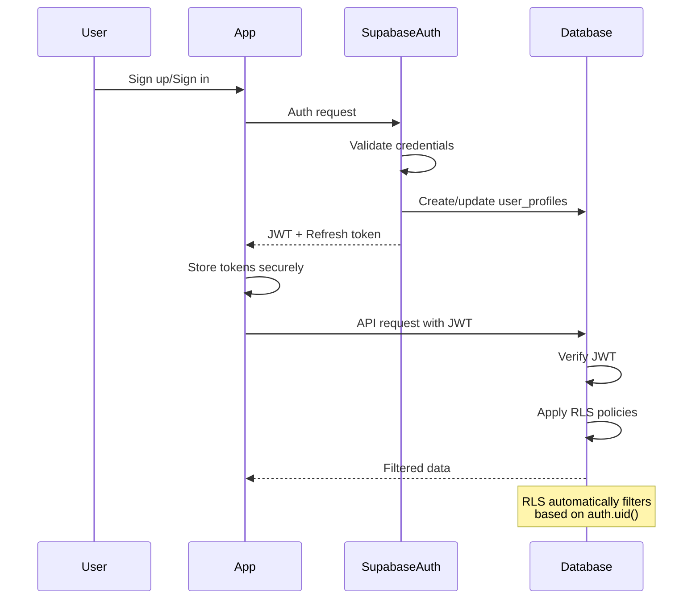

#### Middleware/Guards
```typescript
// Since we're using Supabase, RLS handles authorization
// This is for the minimal Edge Functions we have

// middleware/auth.ts
export async function requireAuth(req: Request): Promise<string> {
  const authHeader = req.headers.get('Authorization');
  if (!authHeader?.startsWith('Bearer ')) {
    throw new Error('Missing auth token');
  }

  const token = authHeader.substring(7);
  const { data, error } = await supabase.auth.getUser(token);
  
  if (error || !data.user) {
    throw new Error('Invalid auth token');
  }
  
  return data.user.id;
}

// Example usage in Edge Function
serve(async (req) => {
  try {
    const userId = await requireAuth(req);
    // Process authenticated request
  } catch (error) {
    return new Response(error.message, { status: 401 });
  }
});
```

## Unified Project Structure

```plaintext
sabron-trip-sync/
├── .github/                    # CI/CD workflows
│   └── workflows/
│       ├── ci.yaml            # Test and lint workflow
│       └── deploy.yaml        # EAS Build workflow
├── .husky/                    # Git hooks
│   ├── pre-commit            # Lint staged files
│   └── commit-msg            # Validate commit messages
├── .vscode/                   # VS Code settings
│   └── settings.json         # Project-specific settings
├── .env.example              # Environment template
├── .env.development          # Development environment
├── .env.production           # Production environment
├── .gitignore               # Git ignore rules
├── .prettierrc.js           # Code formatting
├── app.config.ts            # Expo configuration
├── babel.config.js          # Babel configuration
├── eas.json                 # EAS Build configuration
├── eslint.config.mjs        # ESLint configuration
├── jest.config.js           # Jest test configuration
├── metro.config.js          # Metro bundler config
├── package.json             # Dependencies and scripts
├── pnpm-lock.yaml          # Locked dependencies
├── tailwind.config.js      # NativeWind configuration
├── tsconfig.json           # TypeScript configuration
├── app/                    # Expo Router app directory
│   ├── (auth)/             # Authentication screens
│   │   ├── _layout.tsx     # Auth layout
│   │   ├── sign-in.tsx     # Sign in screen
│   │   ├── sign-up.tsx     # Sign up screen
│   │   └── forgot-password.tsx
│   ├── (app)/              # Authenticated app
│   │   ├── _layout.tsx     # App layout
│   │   ├── (tabs)/         # Tab navigation
│   │   │   ├── _layout.tsx # Tab layout
│   │   │   ├── trips/      # Trips tab
│   │   │   │   ├── index.tsx
│   │   │   │   └── [id].tsx
│   │   │   ├── expenses.tsx
│   │   │   └── profile.tsx
│   │   └── modal/          # Modal screens
│   │       ├── add-expense.tsx
│   │       └── add-trip.tsx
│   └── _layout.tsx         # Root layout
├── assets/                 # Static assets
│   ├── fonts/             # Custom fonts
│   ├── images/            # Images and icons
│   └── splash.png         # Splash screen
├── src/                   # Source code
│   ├── components/        # React Native components
│   │   ├── common/        # Shared components
│   │   ├── expense/       # Expense components
│   │   ├── layout/        # Layout components
│   │   └── trip/          # Trip components
│   ├── constants/         # App constants
│   │   ├── Colors.ts      # Theme colors
│   │   └── Layout.ts      # Layout constants
│   ├── hooks/             # Custom React hooks
│   │   ├── useAuth.ts
│   │   ├── useOfflineSync.ts
│   │   └── useTrip.ts
│   ├── services/          # API services
│   │   ├── api.ts         # Supabase client
│   │   ├── auth.ts        # Auth service
│   │   ├── storage.ts     # MMKV storage
│   │   └── sync.ts        # Sync service
│   ├── stores/            # Zustand stores
│   │   ├── authStore.ts
│   │   ├── syncStore.ts
│   │   └── tripStore.ts
│   ├── types/             # TypeScript types
│   │   ├── database.ts    # Database types
│   │   ├── navigation.ts  # Navigation types
│   │   └── supabase.ts    # Generated types
│   └── utils/             # Utility functions
│       ├── date.ts        # Date formatting
│       ├── currency.ts    # Currency helpers
│       └── vectorClock.ts # Conflict resolution
├── supabase/              # Supabase configuration
│   ├── functions/         # Edge Functions
│   │   ├── webhooks/
│   │   │   └── push-notifications/
│   │   └── scheduled/
│   │       └── exchange-rates/
│   ├── migrations/        # Database migrations
│   │   ├── 001_initial_schema.sql
│   │   └── 002_add_partitions.sql
│   └── config.toml        # Supabase config
├── tests/                 # Test files
│   ├── components/        # Component tests
│   ├── hooks/            # Hook tests
│   ├── services/         # Service tests
│   └── e2e/              # Maestro E2E tests
│       ├── flows/        # Test flows
│       │   ├── auth.yaml
│       │   └── create-trip.yaml
│       └── config.yaml   # Maestro config
└── docs/                 # Documentation
    ├── prd.md            # Product requirements
    ├── architecture.md   # This document
    └── api/              # API documentation
```

## Development Workflow

### Local Development Setup

#### Prerequisites
```bash
# Required tools and versions
node --version  # v20.11.0 or higher
pnpm --version  # v9.0.0 or higher
watchman --version  # Latest
pod --version  # 1.15.0 or higher (macOS)

# iOS development (macOS only)
xcode-select --version  # Xcode 15.0+

# Android development
java --version  # JDK 17
$ANDROID_HOME  # Android SDK path set
```

#### Initial Setup
```bash
# Clone repository
git clone https://github.com/yourusername/sabron-trip-sync.git
cd sabron-trip-sync

# Install dependencies
pnpm install

# iOS dependencies (macOS only)
cd ios && pod install && cd ..

# Setup environment
cp .env.example .env.development
# Edit .env.development with your Supabase credentials

# Setup Supabase locally (optional)
pnpm supabase start
pnpm supabase db reset

# Pre-build for development
pnpm expo prebuild
```

#### Development Commands
```bash
# Start all services
pnpm dev

# Start frontend only
pnpm expo start

# Start backend only
pnpm supabase start

# Run tests
pnpm test              # Unit tests
pnpm test:e2e         # Maestro E2E tests
```

### Environment Configuration

#### Required Environment Variables
```bash
# Frontend (.env.local)
EXPO_PUBLIC_SUPABASE_URL=https://your-project.supabase.co
EXPO_PUBLIC_SUPABASE_ANON_KEY=your-anon-key
EXPO_PUBLIC_SENTRY_DSN=your-sentry-dsn

# Backend (.env)
SUPABASE_SERVICE_KEY=your-service-key
EXCHANGE_API_KEY=your-exchange-api-key
EXPO_PUSH_TOKEN=your-expo-push-token

# Shared
NODE_ENV=development
```

## Deployment Architecture

### Deployment Strategy

**Frontend Deployment:**
- **Platform:** Expo Application Services (EAS)
- **Build Command:** `eas build --platform all --profile production`
- **Output Directory:** Managed by EAS
- **CDN/Edge:** Expo CDN for OTA updates

**Backend Deployment:**
- **Platform:** Supabase Cloud (managed PostgreSQL + services)
- **Build Command:** `pnpm supabase db push --linked`
- **Deployment Method:** Git-based migrations + Edge Function deployment

### CI/CD Pipeline
```yaml
# .github/workflows/deploy.yaml
name: Deploy

on:
  push:
    branches: [main]

jobs:
  test:
    runs-on: ubuntu-latest
    steps:
      - uses: actions/checkout@v4
      - uses: pnpm/action-setup@v3
      - name: Install dependencies
        run: pnpm install
      - name: Run tests
        run: pnpm test
      - name: Run E2E tests
        run: pnpm test:e2e

  build:
    needs: test
    runs-on: ubuntu-latest
    steps:
      - uses: actions/checkout@v4
      - uses: expo/expo-github-action@v8
        with:
          expo-version: latest
          eas-version: latest
          token: ${{ secrets.EXPO_TOKEN }}
      - name: Build on EAS
        run: eas build --platform all --profile production --non-interactive

  deploy:
    needs: build
    runs-on: ubuntu-latest
    steps:
      - name: Deploy to Supabase
        run: |
          pnpm supabase db push --linked
          pnpm supabase functions deploy
      - name: Submit to stores
        run: eas submit --platform all --profile production
```

### Environments
| Environment | Frontend URL | Backend URL | Purpose |
|-------------|-------------|-------------|----------|
| Development | exp://localhost:8081 | http://localhost:54321 | Local development |
| Staging | https://staging.sabron-trip-sync.app | https://staging-project.supabase.co | Pre-production testing |
| Production | https://apps.apple.com/... & https://play.google.com/... | https://your-project.supabase.co | Live environment |

## Security and Performance

### Security Requirements

**Frontend Security:**
- CSP Headers: Not applicable for mobile apps
- XSS Prevention: React Native's built-in protections + input sanitization
- Secure Storage: Keychain (iOS) / Keystore (Android) via expo-secure-store

**Backend Security:**
- Input Validation: PostgreSQL constraints + RLS policies
- Rate Limiting: Supabase built-in rate limiting (100 req/min)
- CORS Policy: Not applicable for mobile apps

**Authentication Security:**
- Token Storage: Secure storage with biometric protection
- Session Management: JWT with 1-hour expiry, refresh tokens
- Password Policy: Minimum 8 characters, complexity requirements via Supabase Auth

### Performance Optimization

**Frontend Performance:**
- Bundle Size Target: <5MB initial download
- Loading Strategy: Lazy loading with React.lazy() and Suspense
- Caching Strategy: MMKV for data, Image caching with expo-image

**Backend Performance:**
- Response Time Target: <200ms for cached queries, <500ms for complex operations
- Database Optimization: Indexes, partitioning, materialized views
- Caching Strategy: PostgreSQL query caching + CDN for static assets

## Testing Strategy

### Testing Pyramid
```text
         E2E Tests
        /        \
   Integration Tests
   /            \
Frontend Unit  Backend Unit
```

### Test Organization

#### Frontend Tests
```text
tests/
├── components/
│   ├── TripCard.test.tsx
│   └── ExpenseForm.test.tsx
├── hooks/
│   ├── useAuth.test.ts
│   └── useOfflineSync.test.ts
└── services/
    ├── sync.test.ts
    └── api.test.ts
```

#### Backend Tests
```text
supabase/tests/
├── database/
│   ├── functions.test.sql
│   └── rls.test.sql
└── functions/
    └── webhooks.test.ts
```

#### E2E Tests
```text
tests/e2e/
├── flows/
│   ├── onboarding.yaml
│   ├── create-trip.yaml
│   └── add-expense.yaml
├── helpers/
│   └── test-data.js
└── maestro.yaml
```

### Test Examples

#### Frontend Component Test
```typescript
// tests/components/TripCard.test.tsx
import React from 'react';
import { render, fireEvent } from '@testing-library/react-native';
import { TripCard } from '@/components/trip/TripCard';

describe('TripCard', () => {
  const mockTrip = {
    id: '123',
    name: 'Paris Adventure',
    startDate: new Date('2025-06-01'),
    endDate: new Date('2025-06-07'),
    memberCount: 4,
  };

  it('renders trip information correctly', () => {
    const { getByText } = render(
      <TripCard trip={mockTrip} onPress={jest.fn()} />
    );

    expect(getByText('Paris Adventure')).toBeTruthy();
    expect(getByText('4 members')).toBeTruthy();
  });

  it('calls onPress when tapped', () => {
    const onPress = jest.fn();
    const { getByTestId } = render(
      <TripCard trip={mockTrip} onPress={onPress} testID="trip-card" />
    );

    fireEvent.press(getByTestId('trip-card'));
    expect(onPress).toHaveBeenCalledWith(mockTrip);
  });
});
```

#### Backend API Test
```typescript
// supabase/tests/functions/webhooks.test.ts
import { assertEquals } from 'https://deno.land/std/testing/asserts.ts';

Deno.test('Push notification webhook sends notifications', async () => {
  const response = await fetch('http://localhost:54321/functions/v1/webhooks/push-notifications', {
    method: 'POST',
    headers: {
      'Authorization': 'Bearer test-token',
      'Content-Type': 'application/json',
    },
    body: JSON.stringify({
      type: 'INSERT',
      table: 'expenses',
      record: {
        trip_id: 'test-trip-id',
        paid_by_user_id: 'user-1',
        description: 'Lunch',
      },
    }),
  });

  assertEquals(response.status, 200);
});
```

#### E2E Test
```yaml
# tests/e2e/flows/create-trip.yaml
appId: com.sabron.tripsync
---
- launchApp:
    clearState: true

- assertVisible: "Welcome to Trip Sync"
- tapOn: "Sign In"

- inputText:
    text: "test@example.com"
    id: "email-input"
- inputText:
    text: "password123"
    id: "password-input"
- tapOn: "Sign In"

- assertVisible: "My Trips"
- tapOn: "Create Trip"

- inputText:
    text: "Summer Road Trip"
    id: "trip-name-input"
- tapOn: "June 1, 2025"
- tapOn: "15" # Select date
- tapOn: "Done"

- tapOn: "June 7, 2025"
- tapOn: "21" # Select date
- tapOn: "Done"

- tapOn: "Create Trip"
- assertVisible: "Summer Road Trip"
```

## Coding Standards

### Critical Fullstack Rules
- **Type Sharing:** Always define types in src/types and import from there
- **API Calls:** Never make direct HTTP calls - use the service layer
- **Environment Variables:** Access only through config objects, never process.env directly
- **Error Handling:** All API routes must use the standard error handler
- **State Updates:** Never mutate state directly - use proper state management patterns
- **Async Operations:** Always handle loading and error states in UI
- **Offline First:** All features must work offline with proper sync
- **Security:** Never expose sensitive data in client code

### Naming Conventions
| Element | Frontend | Backend | Example |
|---------|----------|---------|----------|
| Components | PascalCase | - | `UserProfile.tsx` |
| Hooks | camelCase with 'use' | - | `useAuth.ts` |
| API Routes | - | kebab-case | `/api/user-profile` |
| Database Tables | - | snake_case | `user_profiles` |

## Error Handling Strategy

### Error Flow
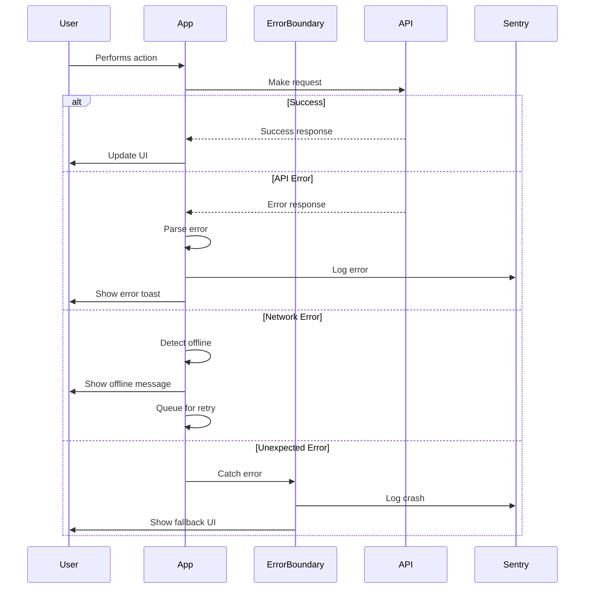

### Error Response Format
```typescript
interface ApiError {
  error: {
    code: string;
    message: string;
    details?: Record<string, any>;
    timestamp: string;
    requestId: string;
  };
}
```

### Frontend Error Handling
```typescript
// utils/errorHandler.ts
import * as Sentry from '@sentry/react-native';
import { showToast } from './toast';

export class AppError extends Error {
  constructor(
    public code: string,
    message: string,
    public details?: any
  ) {
    super(message);
  }
}

export function handleError(error: unknown): void {
  console.error('Error occurred:', error);

  if (error instanceof AppError) {
    // Known application error
    showToast({
      type: 'error',
      message: error.message,
    });
  } else if (error instanceof TypeError && error.message.includes('Network')) {
    // Network error
    showToast({
      type: 'warning',
      message: 'No internet connection. Changes will sync when online.',
    });
  } else {
    // Unknown error
    Sentry.captureException(error);
    showToast({
      type: 'error',
      message: 'Something went wrong. Please try again.',
    });
  }
}

// React Error Boundary
export class ErrorBoundary extends React.Component<
  { children: React.ReactNode },
  { hasError: boolean }
> {
  state = { hasError: false };

  static getDerivedStateFromError() {
    return { hasError: true };
  }

  componentDidCatch(error: Error, errorInfo: ErrorInfo) {
    Sentry.captureException(error, { contexts: { react: errorInfo } });
  }

  render() {
    if (this.state.hasError) {
      return <ErrorFallback onReset={() => this.setState({ hasError: false })} />;
    }
    return this.props.children;
  }
}
```

### Backend Error Handling
```typescript
// Edge Function error handler (minimal usage)
export function handleFunctionError(error: unknown): Response {
  console.error('Function error:', error);

  if (error instanceof Error) {
    return new Response(
      JSON.stringify({
        error: {
          code: 'FUNCTION_ERROR',
          message: error.message,
          timestamp: new Date().toISOString(),
        },
      }),
      { status: 500, headers: { 'Content-Type': 'application/json' } }
    );
  }

  return new Response('Internal Server Error', { status: 500 });
}

// Database errors are handled by Supabase automatically
// RLS policy violations return 403
// Constraint violations return 400 with details
```

## Monitoring and Observability

### Monitoring Stack
- **Frontend Monitoring:** Sentry for React Native
- **Backend Monitoring:** Supabase Dashboard + Logs
- **Error Tracking:** Sentry with source maps
- **Performance Monitoring:** Sentry Performance + Custom metrics

### Key Metrics
**Frontend Metrics:**
- Core Web Vitals
- JavaScript errors
- API response times
- User interactions

**Backend Metrics:**
- Request rate
- Error rate
- Response time
- Database query performance

## Checklist Results Report

The fullstack architecture document for Sabron Trip Sync v2 is complete and ready for implementation. The architecture leverages modern technologies and patterns to deliver a performant, offline-first mobile application that meets all PRD requirements.

Key architectural decisions:
- React Native with Expo for cross-platform mobile development
- Supabase BaaS to eliminate serverless cold starts
- Database-driven business logic for consistency and performance
- Offline-first with MMKV and vector clocks for conflict resolution
- Single repository structure for simplified development
- Comprehensive testing strategy with Maestro for E2E tests

The document provides clear guidance for AI-driven development with specific code examples, patterns, and standards that ensure consistency across the entire stack.