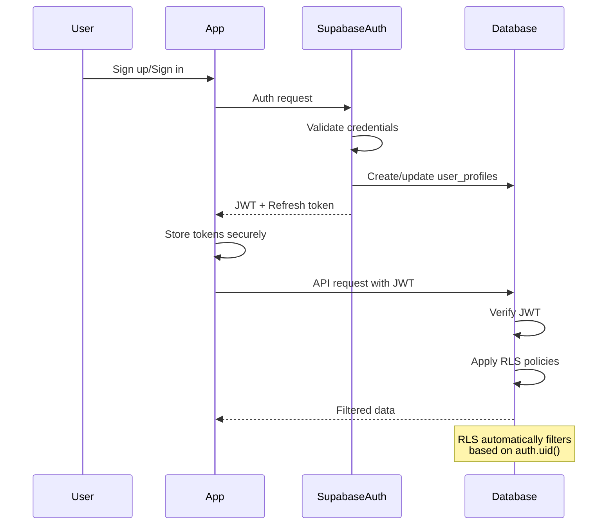

# Backend Architecture

## Service Architecture

### Database-Driven Architecture
```text
Supabase Backend Structure:
├── PostgreSQL Database
│   ├── Tables with RLS
│   ├── Database Functions (Business Logic)
│   ├── Triggers for automation
│   └── Materialized Views for performance
├── PostgREST API (Auto-generated)
├── Realtime Engine
├── Auth Service
├── Storage Service
└── Edge Functions (Minimal)
    ├── webhooks/
    │   └── push-notifications.ts
    └── scheduled/
        └── exchange-rates.ts
```

## Database Architecture

### Schema Design
```sql
-- Advanced RLS Policies with hierarchical permissions
CREATE POLICY "Trip members can view based on role"
    ON trips FOR SELECT
    USING (
        auth.uid() IN (
            SELECT user_id FROM trip_members
            WHERE trip_id = trips.id
            AND (
                -- Viewers can see basic info
                role = 'viewer' OR
                -- Members can see everything
                role IN ('member', 'editor', 'admin')
            )
            AND accepted_at IS NOT NULL
        )
    );

CREATE POLICY "Trip members can update based on role"
    ON trips FOR UPDATE
    USING (
        auth.uid() IN (
            SELECT user_id FROM trip_members
            WHERE trip_id = trips.id
            AND role IN ('admin', 'editor')
            AND accepted_at IS NOT NULL
        )
    );

-- Materialized views for analytics
CREATE MATERIALIZED VIEW trip_expense_summary AS
SELECT 
    t.id as trip_id,
    COUNT(DISTINCT e.id) as expense_count,
    COUNT(DISTINCT e.paid_by_user_id) as unique_payers,
    SUM(e.amount) as total_amount,
    AVG(e.amount) as average_expense,
    MIN(e.date) as first_expense_date,
    MAX(e.date) as last_expense_date,
    t.settings->>'currency' as currency
FROM trips t
LEFT JOIN expenses e ON e.trip_id = t.id
GROUP BY t.id;

-- Refresh materialized view function
CREATE OR REPLACE FUNCTION refresh_trip_summary()
RETURNS trigger AS $$
BEGIN
    REFRESH MATERIALIZED VIEW CONCURRENTLY trip_expense_summary;
    RETURN NULL;
END;
$$ LANGUAGE plpgsql;

-- Trigger to refresh summary
CREATE TRIGGER refresh_summary_on_expense_change
AFTER INSERT OR UPDATE OR DELETE ON expenses
FOR EACH STATEMENT
EXECUTE FUNCTION refresh_trip_summary();

-- Performance optimizations with partial indexes
CREATE INDEX idx_active_trips ON trips(start_date, end_date) 
WHERE status IN ('planning', 'active');

CREATE INDEX idx_unsettled_expenses ON expense_splits(user_id) 
WHERE is_settled = FALSE;

-- Function for complex business logic
CREATE OR REPLACE FUNCTION create_trip_with_member(
    p_name TEXT,
    p_start_date DATE,
    p_end_date DATE,
    p_settings JSONB DEFAULT '{}'::jsonb
)
RETURNS trips AS $$
DECLARE
    v_trip trips;
    v_user_id UUID;
BEGIN
    -- Get current user
    v_user_id := auth.uid();
    IF v_user_id IS NULL THEN
        RAISE EXCEPTION 'Not authenticated';
    END IF;

    -- Create trip
    INSERT INTO trips (name, start_date, end_date, settings, created_by)
    VALUES (p_name, p_start_date, p_end_date, p_settings, v_user_id)
    RETURNING * INTO v_trip;

    -- Add creator as admin
    INSERT INTO trip_members (trip_id, user_id, role, accepted_at)
    VALUES (v_trip.id, v_user_id, 'admin', NOW());

    RETURN v_trip;
END;
$$ LANGUAGE plpgsql SECURITY DEFINER;

-- Optimized expense splitting function
CREATE OR REPLACE FUNCTION split_expense(
    p_expense_id UUID,
    p_split_method TEXT,
    p_participants UUID[],
    p_custom_splits JSONB DEFAULT NULL
)
RETURNS SETOF expense_splits AS $$
DECLARE
    v_expense expenses;
    v_split_amount DECIMAL(10,2);
    v_participant UUID;
    v_custom_amount DECIMAL(10,2);
BEGIN
    -- Get expense details
    SELECT * INTO v_expense FROM expenses WHERE id = p_expense_id;
    
    IF NOT FOUND THEN
        RAISE EXCEPTION 'Expense not found';
    END IF;

    -- Delete existing splits
    DELETE FROM expense_splits WHERE expense_id = p_expense_id;

    CASE p_split_method
        WHEN 'equal' THEN
            v_split_amount := v_expense.amount / array_length(p_participants, 1);
            FOREACH v_participant IN ARRAY p_participants LOOP
                INSERT INTO expense_splits (expense_id, user_id, amount)
                VALUES (p_expense_id, v_participant, v_split_amount);
            END LOOP;

        WHEN 'custom' THEN
            FOR v_participant, v_custom_amount IN 
                SELECT * FROM jsonb_each_text(p_custom_splits) LOOP
                INSERT INTO expense_splits (expense_id, user_id, amount)
                VALUES (p_expense_id, v_participant::UUID, v_custom_amount::DECIMAL);
            END LOOP;

        ELSE
            RAISE EXCEPTION 'Invalid split method';
    END CASE;

    RETURN QUERY SELECT * FROM expense_splits WHERE expense_id = p_expense_id;
END;
$$ LANGUAGE plpgsql SECURITY DEFINER;
```

### Data Access Layer
```typescript
// This is conceptual - actual implementation happens in database
// Edge functions only handle webhooks and scheduled tasks

// supabase/functions/webhooks/push-notifications.ts
import { serve } from 'https://deno.land/std@0.168.0/http/server.ts';
import { Expo } from 'https://esm.sh/expo-server-sdk@3.7.0';

const expo = new Expo();

serve(async (req) => {
  const { record, type } = await req.json();
  
  if (type === 'INSERT' && record.table === 'expenses') {
    // Get push tokens for trip members
    const { data: members } = await supabase
      .from('trip_members')
      .select('user:user_profiles!inner(push_token)')
      .eq('trip_id', record.trip_id)
      .not('user_id', 'eq', record.paid_by_user_id);

    const messages = members
      .filter(m => m.user?.push_token)
      .map(m => ({
        to: m.user.push_token,
        sound: 'default',
        body: `New expense added: ${record.description}`,
        data: { type: 'expense', tripId: record.trip_id },
      }));

    await expo.sendPushNotificationsAsync(messages);
  }
  
  return new Response('OK', { status: 200 });
});

// supabase/functions/scheduled/exchange-rates.ts
import { serve } from 'https://deno.land/std@0.168.0/http/server.ts';

serve(async (req) => {
  // This runs daily via cron
  const response = await fetch(`https://api.exchangeratesapi.io/v1/latest?access_key=${EXCHANGE_API_KEY}`);
  const rates = await response.json();
  
  // Store in database for offline access
  await supabase
    .from('exchange_rates')
    .upsert({
      date: new Date().toISOString().split('T')[0],
      rates: rates.rates,
      base: rates.base,
    });
  
  return new Response('OK', { status: 200 });
});
```

## Authentication and Authorization

### Auth Flow


### Middleware/Guards
```typescript
// Since we're using Supabase, RLS handles authorization
// This is for the minimal Edge Functions we have

// middleware/auth.ts
export async function requireAuth(req: Request): Promise<string> {
  const authHeader = req.headers.get('Authorization');
  if (!authHeader?.startsWith('Bearer ')) {
    throw new Error('Missing auth token');
  }

  const token = authHeader.substring(7);
  const { data, error } = await supabase.auth.getUser(token);
  
  if (error || !data.user) {
    throw new Error('Invalid auth token');
  }
  
  return data.user.id;
}

// Example usage in Edge Function
serve(async (req) => {
  try {
    const userId = await requireAuth(req);
    // Process authenticated request
  } catch (error) {
    return new Response(error.message, { status: 401 });
  }
});
```
