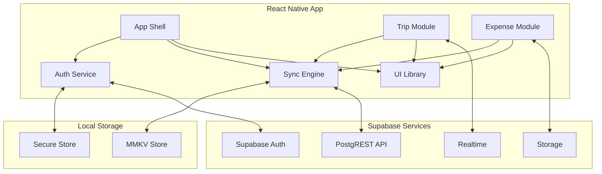

# Components

## Mobile Application Shell
**Responsibility:** Root component managing navigation, authentication state, and offline sync orchestration

**Key Interfaces:**
- Navigation container with deep linking support
- Global error boundary for crash recovery
- Network state monitoring for sync triggers
- Background task registration for sync

**Dependencies:** Expo Router, React Native NetInfo, expo-background-fetch

**Technology Stack:** React Native 0.79.4, TypeScript 5.8.3, Expo SDK 53

## Authentication Service
**Responsibility:** Handle multi-provider authentication, session management, and biometric unlock

**Key Interfaces:**
- `signIn(method: 'email' | 'google' | 'apple' | 'magic-link')`
- `signOut()`
- `refreshSession()`
- `enableBiometric()`

**Dependencies:** Supabase Auth, expo-local-authentication, expo-secure-store

**Technology Stack:** Supabase Auth SDK, React Native Keychain

## Offline Sync Engine
**Responsibility:** Manage local storage, conflict resolution, and background synchronization

**Key Interfaces:**
- `saveOffline(table: string, data: any)`
- `syncWithServer()`
- `resolveConflicts(conflicts: Conflict[])`
- `getOfflineQueue()`

**Dependencies:** MMKV Storage, NetInfo, Vector Clock implementation

**Technology Stack:** react-native-mmkv 3.1.0, custom vector clock algorithm

## Trip Management Module
**Responsibility:** Handle trip CRUD operations, member management, and real-time updates

**Key Interfaces:**
- `createTrip(trip: TripInput)`
- `inviteMember(tripId: string, email: string)`
- `subscribeToTripUpdates(tripId: string)`
- `archiveTrip(tripId: string)`

**Dependencies:** Supabase Realtime, PostgREST client, Share API

**Technology Stack:** Supabase JS Client, React Native Share

## Expense Tracking Module
**Responsibility:** Manage expense entry, splitting algorithms, and settlement calculations

**Key Interfaces:**
- `addExpense(expense: ExpenseInput)`
- `calculateSplits(amount: number, method: SplitMethod, participants: string[])`
- `getBalances(tripId: string)`
- `markAsSettled(expenseId: string, userId: string)`

**Dependencies:** Database functions, OCR service integration

**Technology Stack:** PostgreSQL functions, react-native-vision-camera

## UI Component Library
**Responsibility:** Provide consistent, accessible, and performant UI components

**Key Interfaces:**
- Core components (Button, Input, Card, Modal)
- Trip-specific components (ExpenseCard, TripTimeline, MemberAvatar)
- Layout components (Screen, Header, TabBar)
- Form components with validation

**Dependencies:** NativeWind, React Native Elements, react-hook-form

**Technology Stack:** NativeWind 4.1.23, React Native Gesture Handler

## Component Diagrams

