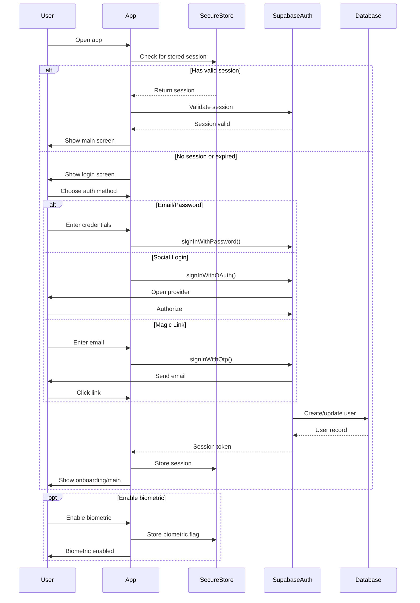
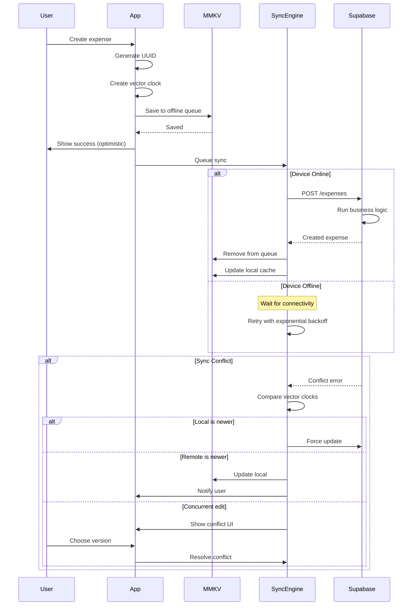
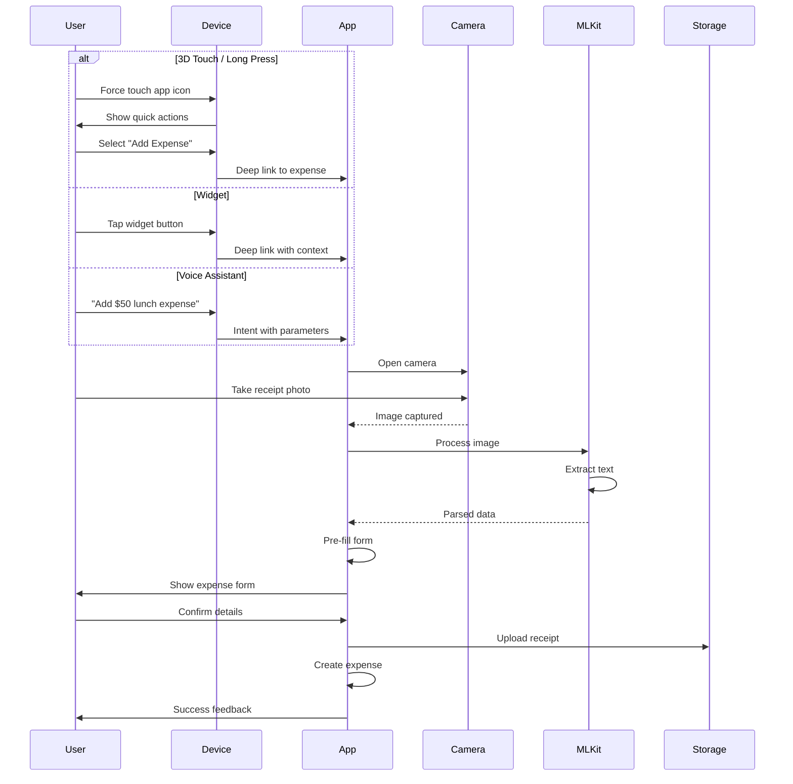
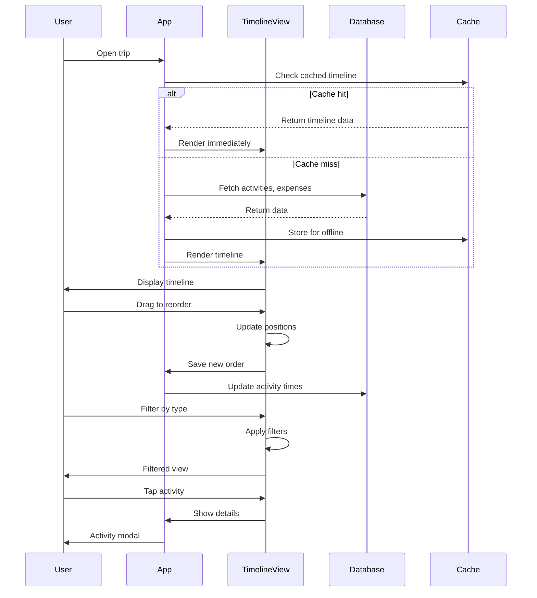
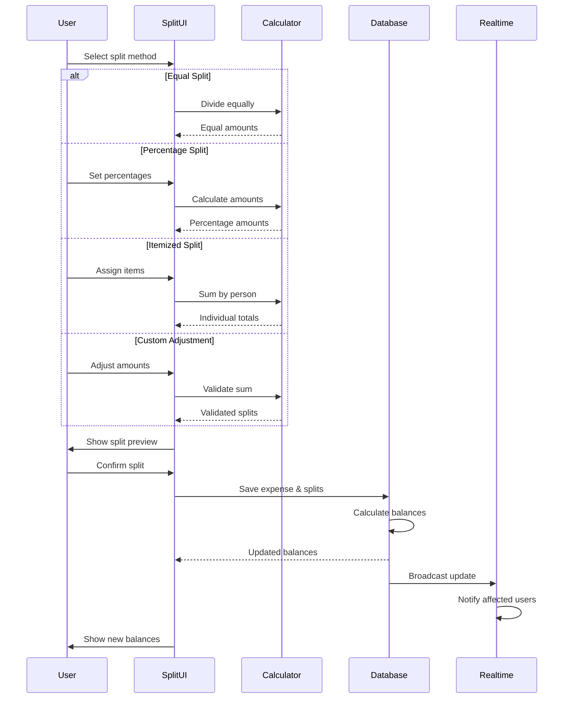
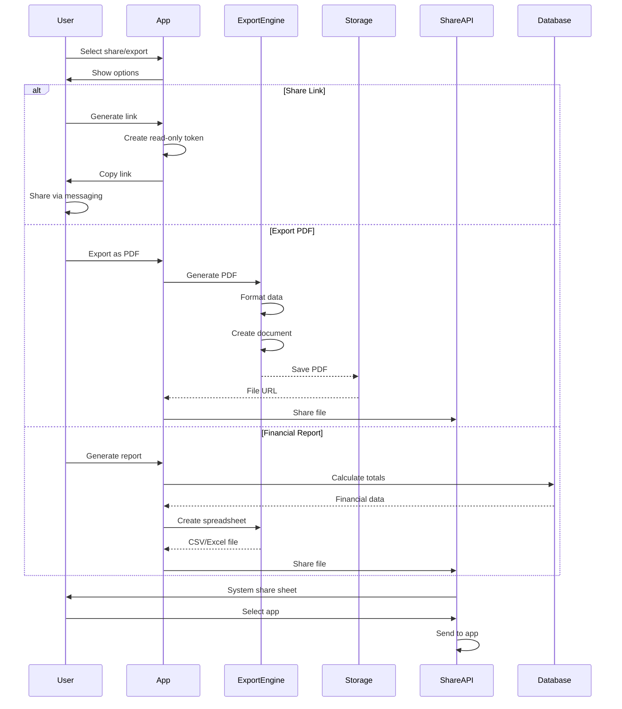
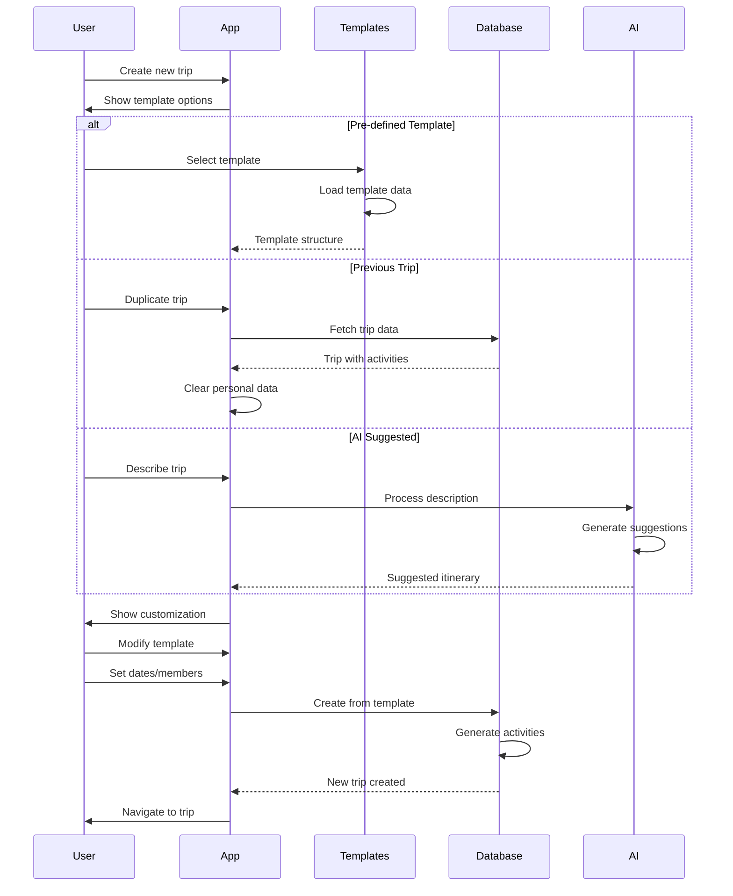
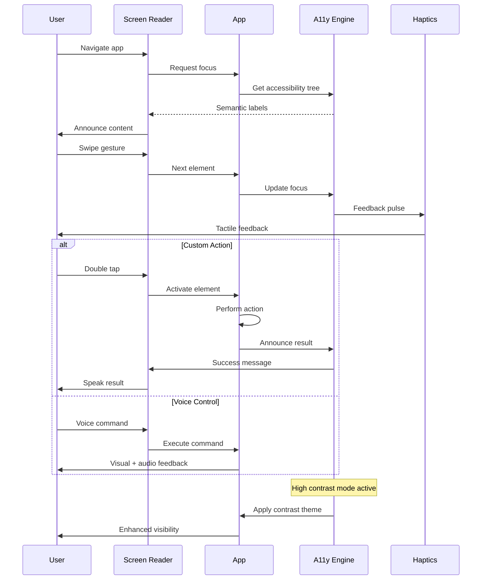

# Core Workflows

## User Authentication Flow


## Offline-First Expense Creation


## Real-time Trip Collaboration
```mermaid
sequenceDiagram
    participant User1
    participant App1
    participant Realtime
    participant Database
    participant App2
    participant User2
    
    User1->>App1: Update trip details
    App1->>Database: UPDATE trips
    Database-->>App1: Confirmed
    
    Database->>Realtime: Broadcast change
    
    Realtime->>App2: Push update
    App2->>App2: Update local state
    App2->>User2: Show changes
    
    par Expense added
        User2->>App2: Add expense
        App2->>Database: INSERT expense
        Database->>Realtime: Broadcast
        Realtime->>App1: Push update
        App1->>User1: Show new expense
    and Member joined
        User2->>App2: Accept invite
        App2->>Database: UPDATE trip_members
        Database->>Realtime: Broadcast
        Realtime->>App1: Member joined
        App1->>User1: Update member list
    end
    
    Note over Realtime: Presence tracking
    App1->>Realtime: User1 active
    App2->>Realtime: User2 active
    Realtime->>App1,App2: Broadcast presence
```

## Mobile-Specific: Quick Add with Shortcuts


## Trip Activity Timeline View


## Smart Expense Splitting


## Share Trip & Export


## Quick Trip Templates


## Accessibility Navigation

