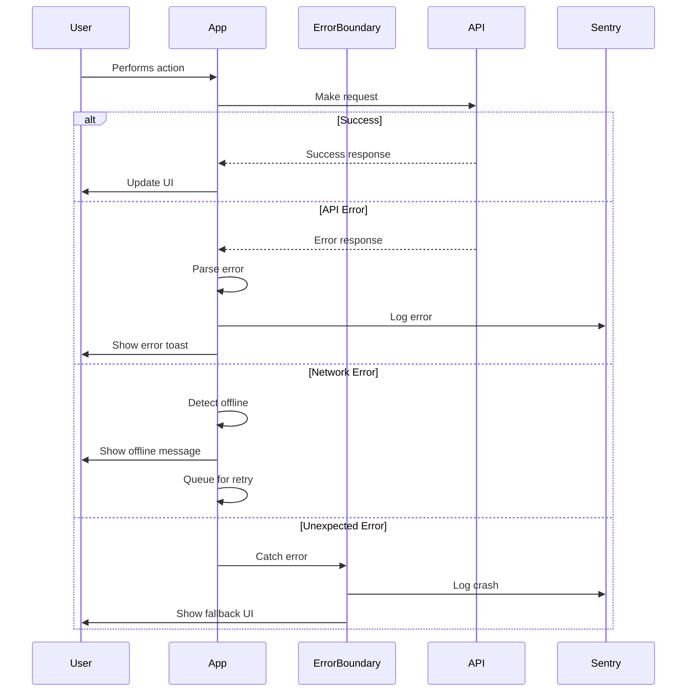

# Error Handling Strategy

## Error Flow


## Error Response Format
```typescript
interface ApiError {
  error: {
    code: string;
    message: string;
    details?: Record<string, any>;
    timestamp: string;
    requestId: string;
  };
}
```

## Frontend Error Handling
```typescript
// utils/errorHandler.ts
import * as Sentry from '@sentry/react-native';
import { showToast } from './toast';

export class AppError extends Error {
  constructor(
    public code: string,
    message: string,
    public details?: any
  ) {
    super(message);
  }
}

export function handleError(error: unknown): void {
  console.error('Error occurred:', error);

  if (error instanceof AppError) {
    // Known application error
    showToast({
      type: 'error',
      message: error.message,
    });
  } else if (error instanceof TypeError && error.message.includes('Network')) {
    // Network error
    showToast({
      type: 'warning',
      message: 'No internet connection. Changes will sync when online.',
    });
  } else {
    // Unknown error
    Sentry.captureException(error);
    showToast({
      type: 'error',
      message: 'Something went wrong. Please try again.',
    });
  }
}

// React Error Boundary
export class ErrorBoundary extends React.Component<
  { children: React.ReactNode },
  { hasError: boolean }
> {
  state = { hasError: false };

  static getDerivedStateFromError() {
    return { hasError: true };
  }

  componentDidCatch(error: Error, errorInfo: ErrorInfo) {
    Sentry.captureException(error, { contexts: { react: errorInfo } });
  }

  render() {
    if (this.state.hasError) {
      return <ErrorFallback onReset={() => this.setState({ hasError: false })} />;
    }
    return this.props.children;
  }
}
```

## Backend Error Handling
```typescript
// Edge Function error handler (minimal usage)
export function handleFunctionError(error: unknown): Response {
  console.error('Function error:', error);

  if (error instanceof Error) {
    return new Response(
      JSON.stringify({
        error: {
          code: 'FUNCTION_ERROR',
          message: error.message,
          timestamp: new Date().toISOString(),
        },
      }),
      { status: 500, headers: { 'Content-Type': 'application/json' } }
    );
  }

  return new Response('Internal Server Error', { status: 500 });
}

// Database errors are handled by Supabase automatically
// RLS policy violations return 403
// Constraint violations return 400 with details
```
