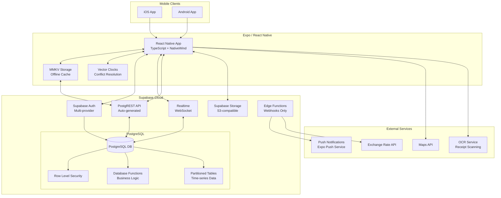

# High Level Architecture

## Technical Summary

Sabron Trip Sync v2 is a React Native mobile application built on Expo SDK 53 with a database-driven Backend-as-a-Service (BaaS) architecture using Supabase. The application leverages React Native's New Architecture for optimal performance while maintaining offline-first capabilities through MMKV local storage and vector clocks for conflict resolution. By pushing business logic to PostgreSQL functions and using Supabase's built-in Auth, Realtime, and Storage services, we eliminate serverless cold starts while maintaining scalability. The architecture achieves the PRD goals of seamless offline functionality, real-time collaboration, and sub-2 second screen loads through intelligent caching, optimistic updates, and database-level optimizations.

## Platform and Infrastructure Choice

**Platform:** Supabase (Primary) + Expo EAS (Build/Deploy)
**Key Services:** PostgreSQL, Auth, Realtime, Storage, Edge Functions (minimal)
**Deployment Host and Regions:** Supabase Cloud (US-East primary, EU-West replica for low latency)

## Repository Structure

**Structure:** Single Repository
**Monorepo Tool:** N/A - Single unified codebase
**Package Organization:** Feature-based with shared utilities

## High Level Architecture Diagram

## Architectural Patterns

- **Database-Driven Architecture:** PostgreSQL functions handle business logic to avoid serverless cold starts - _Rationale:_ Eliminates cold starts while maintaining scalability and consistency
- **Offline-First with Sync:** MMKV for local storage with vector clock conflict resolution - _Rationale:_ Ensures full functionality without connectivity as per PRD requirements
- **Row Level Security (RLS):** Database-level security for multi-tenant isolation - _Rationale:_ Provides secure, performant data access without additional API logic
- **BaaS Pattern:** Leverage Supabase's managed services for auth, realtime, and storage - _Rationale:_ Reduces infrastructure complexity while maintaining enterprise capabilities
- **Component-Based UI:** Reusable React Native components with NativeWind styling - _Rationale:_ Consistent UI/UX with minimal bundle size using Tailwind utilities
