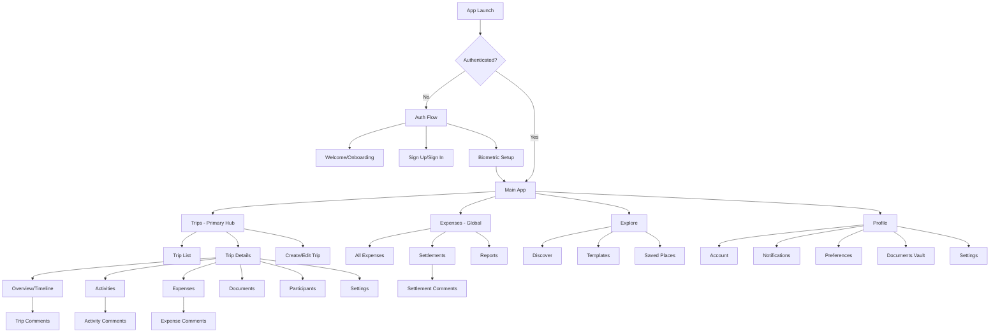
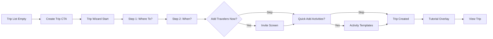
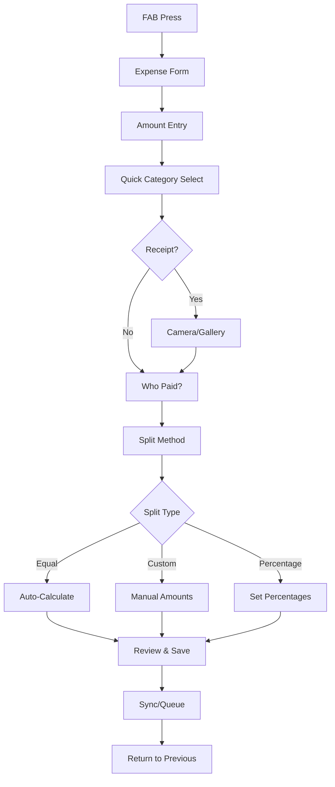
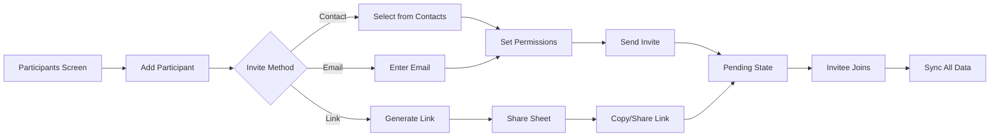
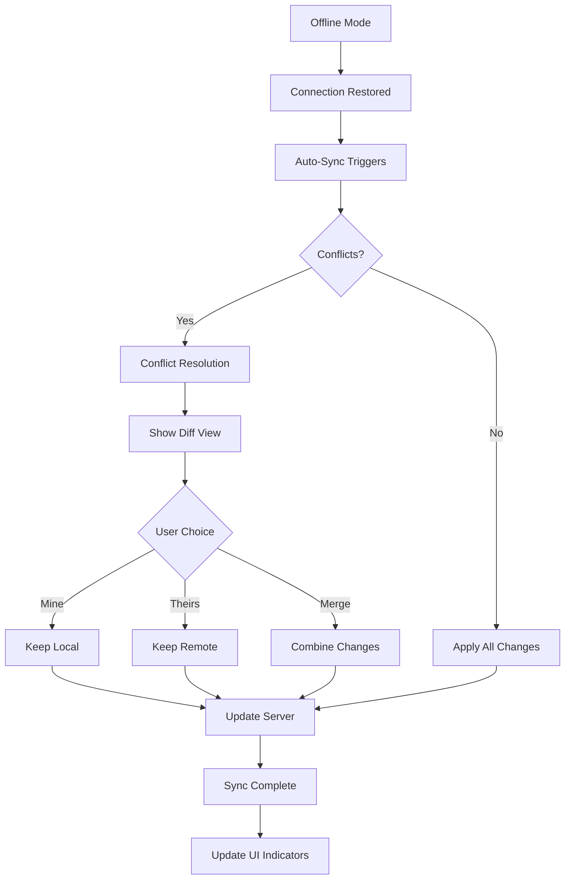
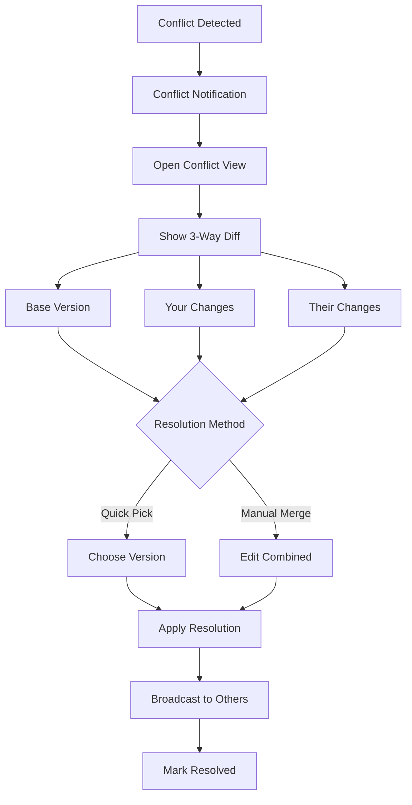

# Trip Sync v2 UI/UX Specification

## Introduction

This document defines the user experience goals, information architecture, user flows, and visual design specifications for Trip Sync v2's user interface. It serves as the foundation for visual design and frontend development, ensuring a cohesive and user-centered experience.

### Overall UX Goals & Principles

#### Target User Personas

1. **The Efficient Professional** (Business Traveler)
   - Travels 2-3 times per month for work
   - Needs: Quick expense categorization, receipt management, company policy compliance
   - Pain points: Separating personal/business expenses, generating reports
   - Key features: Auto-categorization, PDF export, integration with expense systems

2. **The Global Explorer** (International Leisure)
   - Plans 3-5 international trips per year
   - Needs: Visa tracking, currency conversion, timezone management, offline maps
   - Pain points: Document organization, language barriers, connectivity issues
   - Key features: Document vault, embassy contacts, translation helpers

3. **The Regional Wanderer** (Domestic Leisure)
   - Takes 4-6 domestic trips annually
   - Needs: Simpler logistics, focus on activities and coordination
   - Pain points: Group coordination, local discovery
   - Key features: Local recommendations, drive-time calculations

4. **The Group Coordinator** (Social Organizer)
   - Organizes trips for families/friends/colleagues
   - Needs: Real-time collaboration, expense splitting, activity voting
   - Pain points: Herding cats, tracking who owes what
   - Key features: Delegation tools, voting systems, settlement tracking

5. **The Budget Keeper** (Cost-Conscious Traveler)
   - Carefully tracks every expense
   - Needs: Budget alerts, cost comparisons, deal finding
   - Pain points: Overspending, hidden costs, currency confusion
   - Key features: Real-time budget tracking, predictive costing

#### Usability Goals

1. **Time to Magic**: First successful sync between 2 users in <5 minutes
2. **First Trip Completeness**: Trip with 3+ activities and 1+ collaborator in <10 minutes
3. **Offline Confidence**: 100% core features available offline with smart cache indicators
4. **Contextual Ergonomics**: Two-handed optimization for setup, one-handed for travel
5. **Instant Sync**: <500ms for group updates when online
6. **Progressive Learning**: 3 layers of complexity (Simple, Standard, Power modes)
7. **Error-Free Onboarding**: >90% of users complete onboarding without errors
8. **Activation Rate**: >70% of users complete their first full trip

#### Design Principles

1. **📱 Mobile-First, Offline-Always** - Every feature works offline; sync is invisible magic
2. **🎯 Progressive Power Through Layers** - Simple surface, discoverable depth, optional complexity
3. **👥 Collaborative Transparency** - Every action has clear ownership; every change is traceable
4. **⚡ Anticipatory Assistance** - Predict needs based on context (location, time, past behavior)
5. **🛡️ Privacy by Design** - Local encryption, biometric locks, clear data handling
6. **🌍 Cultural Intelligence** - Locale-aware formats, RTL support, cultural sensitivity
7. **💰 Financial Clarity** - Every cost visible, real-time conversions, clear settlements
8. **♿ Inclusive by Default** - Voice control, high contrast, screen reader optimized
9. **🤝 Graceful Conflict Resolution** - Visual diffs, one-tap resolution, conflict prevention

### Change Log

| Date | Version | Description | Author |
|------|---------|-------------|--------|
| 2025-01-02 | 1.0 | Initial UI/UX Specification | Sally (UX Expert) |

## Information Architecture (IA)

### Site Map / Screen Inventory

### Navigation Structure

**Primary Navigation:** Bottom tab bar with 4 tabs for optimal thumb reach
- 🗺️ **Trips** - Central hub for all trip management
- 💰 **Expenses** - Global expense view across all trips
- 🧭 **Explore** - Discovery and planning tools
- 👤 **Profile** - Account, settings, and notifications

**Secondary Navigation:** Contextual top tabs within Trip Details
- Swipeable tabs for Overview, Activities, Expenses, Documents, Participants
- Persistent trip header with key info (dates, destination, participant count)

**Breadcrumb Strategy:** Smart breadcrumbs that show:
- Current location in hierarchy
- Offline/online sync status
- Quick jump to trip list

## User Flows

### Flow 1: First-Time Trip Creation (Onboarding)

**User Goal:** Create first trip and understand core value proposition

**Entry Points:** 
- Post-registration landing
- Empty state "Create Your First Trip" CTA
- Onboarding tutorial prompt

**Success Criteria:**
- Trip created with destination and dates
- At least one activity added
- Understanding of offline capability demonstrated

**Edge Cases & Error Handling:**
- No internet during creation → All steps work offline, sync badge appears
- Invalid dates → Inline validation, end date auto-adjusts if before start
- Duplicate trip → Warning with option to continue or edit existing

**Notes:** Progressive disclosure - advanced options hidden in "More Options" to avoid overwhelming new users

### Flow 2: Add Expense with Split

**User Goal:** Quickly record an expense and fairly split among participants

**Entry Points:**
- Floating Action Button (global)
- Trip > Expenses tab > Add button  
- Long-press on activity (contextual expense)

**Success Criteria:**
- Expense recorded in <30 seconds
- Correct split calculation
- All participants see update

**Edge Cases & Error Handling:**
- Split doesn't sum to total → Show difference, suggest adjustment
- Offline creation → Queue for sync, show pending badge
- Currency mismatch → Auto-convert with rate disclaimer

**Notes:** One-handed operation critical - number pad should be thumb-reachable

### Flow 3: Invite Collaborator

**User Goal:** Add someone to trip for collaboration

**Entry Points:**
- Trip settings > Participants
- Empty participant slot
- Share button in trip header

**Success Criteria:**
- Invite sent successfully
- Invitee can join with single tap
- Permissions correctly set

**Edge Cases & Error Handling:**
- Invitee already member → Show error, navigate to participant
- No internet → Generate link for later sending
- Permission conflicts → Show comparison, ask for resolution

### Flow 4: Offline to Online Sync

**User Goal:** Seamlessly sync offline changes when connection restored

**Entry Points:**
- Automatic on connection restore
- Pull-to-refresh gesture
- Tap sync indicator

**Success Criteria:**
- All changes synchronized
- Conflicts resolved appropriately
- User informed of sync status

**Edge Cases & Error Handling:**
- Partial sync failure → Retry queue, show items pending
- Version too old → Force refresh, re-apply local changes
- Sync timeout → Progressive sync, priority queue

**Notes:** Visual feedback critical - users need confidence their data is safe

### Flow 5: Resolve Conflict

**User Goal:** Resolve editing conflict when multiple users edited same item

**Entry Points:**
- Sync conflict notification
- Conflict indicator on item
- Sync status screen

**Success Criteria:**
- Conflict resolved without data loss
- All participants see resolution
- Understanding why conflict occurred

**Edge Cases & Error Handling:**
- Multiple conflicts → Queue system, resolve one by one
- Can't reach consensus → "Park" conflict, continue with fork
- Cascade conflicts → Smart grouping of related conflicts

**Notes:** Educational opportunity - help users understand distributed systems
