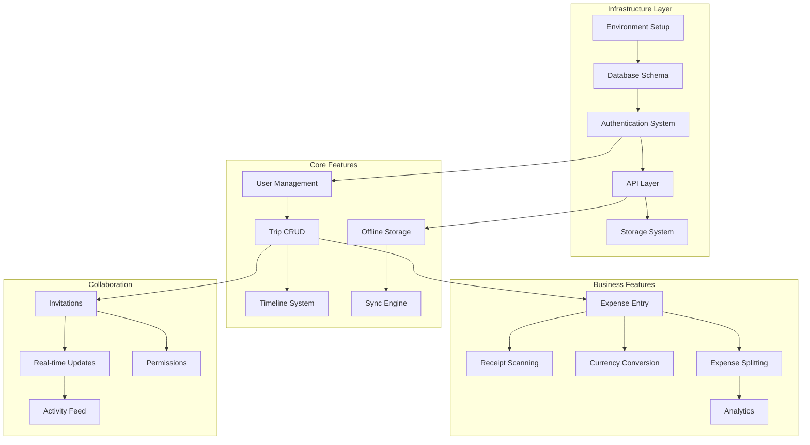

# Feature Sequencing Optimization Guide

## Executive Summary

This document provides an optimized feature sequencing strategy for Trip Sync v2, ensuring maximum development efficiency, minimal blockers, and optimal user value delivery throughout the project lifecycle.

## Feature Dependency Graph



## Optimal Feature Sequencing Strategy

### Phase 1: Foundation (Weeks 1-4)
**Goal**: Establish rock-solid infrastructure with zero technical debt

```yaml
week_1_2_infrastructure:
  parallel_track_1:
    - Environment setup automation
    - CI/CD pipeline configuration
    - Development tooling
    - Documentation framework
  
  parallel_track_2:
    - Supabase project setup
    - Database schema design
    - Migration framework
    - Seed data scripts
  
  parallel_track_3:
    - External service registration
    - API key management
    - Environment configuration
    - Secret management

week_3_4_core_systems:
  sequential_development:
    1. Authentication foundation
       - Supabase Auth setup
       - Session management
       - Token handling
       - Security policies
    
    2. Data access layer
       - TypeScript types generation
       - API client setup
       - Error handling
       - Retry mechanisms
    
    3. State management
       - Store architecture
       - Persistence layer
       - Hydration system
       - DevTools integration
```

### Phase 2: Core Features (Weeks 5-8)
**Goal**: Deliver MVP functionality with premium UX

```yaml
week_5_6_user_features:
  feature_sequence:
    1. User registration/login
       dependencies: [auth_system]
       value: Enables all other features
       risk: Low (well-defined)
    
    2. User profile management
       dependencies: [user_auth, storage]
       value: Personalization
       risk: Low
    
    3. Trip creation wizard
       dependencies: [user_system, database]
       value: Core functionality
       risk: Medium (UX complexity)

week_7_8_trip_management:
  parallel_features:
    track_1:
      - Trip list view
      - Trip detail view
      - Trip templates
    
    track_2:
      - Timeline component
      - Drag-drop functionality
      - Activity management
    
    track_3:
      - Map integration
      - Location search
      - Route planning
```

### Phase 3: Offline & Sync (Weeks 9-12)
**Goal**: Bulletproof offline functionality

```yaml
week_9_10_offline_foundation:
  critical_path:
    1. MMKV storage setup
       - Encryption configuration
       - Data models
       - Migration system
    
    2. Offline queue implementation
       - Operation tracking
       - Priority system
       - Persistence
    
    3. Network detection
       - Connection monitoring
       - State transitions
       - UI indicators

week_11_12_sync_engine:
  complex_features:
    1. Vector clock implementation
       complexity: High
       testing_required: Extensive
       fallback: Last-write-wins
    
    2. Conflict resolution UI
       complexity: Medium
       testing_required: User testing
       fallback: Manual resolution
    
    3. Background sync
       complexity: Medium
       testing_required: Device testing
       fallback: Manual sync
```

### Phase 4: Business Features (Weeks 13-16)
**Goal**: Revenue-generating features

```yaml
week_13_14_expense_core:
  value_delivery_sequence:
    1. Quick expense entry
       user_value: High
       complexity: Low
       revenue_impact: Direct
    
    2. Receipt scanning
       user_value: High
       complexity: High
       revenue_impact: Premium feature
    
    3. Multi-currency support
       user_value: Medium
       complexity: Medium
       revenue_impact: International users

week_15_16_expense_advanced:
  monetization_features:
    1. Expense splitting
       - Equal splits (free)
       - Custom splits (premium)
       - Settlement tracking
    
    2. Analytics & reports
       - Basic reports (free)
       - Advanced insights (premium)
       - Export functionality
```

### Phase 5: Collaboration (Weeks 17-18)
**Goal**: Multi-user engagement

```yaml
collaboration_rollout:
  incremental_features:
    1. Basic invitations
       - Email invites
       - Accept/reject flow
       - Member list
    
    2. Real-time updates
       - Expense changes
       - Trip modifications
       - Presence indicators
    
    3. Advanced collaboration
       - Comments
       - Chat
       - Task assignments
```

## Parallel Development Opportunities

### Frontend/Backend Parallelization

```yaml
frontend_track:
  week_1_4:
    - Component library
    - Design system
    - Navigation structure
    - Mock data UI
  
  week_5_8:
    - Auth screens
    - Trip screens
    - Offline indicators
    - Sync UI
  
  week_9_12:
    - Expense screens
    - Analytics UI
    - Collaboration UI

backend_track:
  week_1_4:
    - Database schema
    - API endpoints
    - Auth system
    - Storage setup
  
  week_5_8:
    - Business logic
    - Sync engine
    - Queue system
    - Conflict resolution
  
  week_9_12:
    - Real-time system
    - Analytics engine
    - Export system
```

### Feature Flag Strategy

```yaml
progressive_rollout:
  alpha_features:
    - Basic trip management
    - Simple expense tracking
    - Email authentication
  
  beta_features:
    - Social login
    - Receipt scanning
    - Offline sync
    - Basic analytics
  
  ga_features:
    - Full collaboration
    - Advanced analytics
    - All integrations
  
  premium_features:
    - Advanced reports
    - Unlimited storage
    - Priority support
    - API access
```

## Risk-Based Prioritization

### High-Risk Features (Build Early)

```yaml
high_risk_early:
  1_sync_engine:
    risk_factors:
      - Complex logic
      - Data integrity critical
      - Hard to change later
    mitigation:
      - Build in Sprint 4-5
      - Extensive testing
      - Multiple iterations
  
  2_offline_storage:
    risk_factors:
      - Performance impact
      - Storage limitations
      - Migration complexity
    mitigation:
      - Prototype early
      - Benchmark continuously
      - Plan migrations
  
  3_permissions_system:
    risk_factors:
      - Security critical
      - Complex rules
      - User confusion
    mitigation:
      - Design thoroughly
      - Security review
      - User testing
```

### Low-Risk Features (Build Later)

```yaml
low_risk_deferred:
  1_ui_polish:
    - Animations
    - Themes
    - Micro-interactions
    reason: Easy to add later
  
  2_export_features:
    - PDF generation
    - CSV export
    - Email reports
    reason: Independent feature
  
  3_integrations:
    - Calendar sync
    - Accounting software
    - Travel apps
    reason: Can be phased
```

## Technical Debt Prevention

### Code Quality Gates

```yaml
quality_checkpoints:
  per_feature:
    - Unit test coverage >80%
    - Integration tests written
    - Documentation complete
    - Performance benchmarked
    - Security reviewed
  
  per_sprint:
    - Technical debt <5%
    - Code review 100%
    - Refactoring time 20%
    - Documentation updated
  
  per_epic:
    - Architecture review
    - Performance audit
    - Security assessment
    - Dependency update
```

### Refactoring Schedule

```yaml
continuous_improvement:
  week_4:
    focus: Authentication system
    reason: Foundation for all features
  
  week_8:
    focus: State management
    reason: Before offline complexity
  
  week_12:
    focus: Sync engine
    reason: Before collaboration
  
  week_16:
    focus: Performance
    reason: Before beta launch
```

## Performance Optimization Path

### Progressive Enhancement

```yaml
performance_milestones:
  milestone_1_week_4:
    - Cold start <3s
    - Basic features 60fps
    - Memory <100MB
  
  milestone_2_week_8:
    - Cold start <2.5s
    - All screens 60fps
    - Memory <120MB
  
  milestone_3_week_12:
    - Cold start <2s
    - Offline sync smooth
    - Memory <140MB
  
  milestone_4_week_16:
    - All targets met
    - Battery optimized
    - Network efficient
```

## User Value Delivery Timeline

### MVP Feature Set (Week 8)

```yaml
mvp_deliverables:
  must_have:
    - User registration/login
    - Create/edit trips
    - Basic expense tracking
    - Offline viewing
  
  nice_to_have:
    - Social login
    - Trip templates
    - Basic analytics
  
  defer_to_v2:
    - Advanced analytics
    - Integrations
    - AI features
```

### Beta Release Features (Week 16)

```yaml
beta_features:
  core_complete:
    - All authentication methods
    - Full trip management
    - Offline sync working
    - Expense splitting
    - Basic collaboration
  
  polish_items:
    - Smooth animations
    - Error recovery
    - Help system
    - Onboarding
```

## Success Metrics

### Development Efficiency

```yaml
efficiency_metrics:
  velocity:
    - Sprint 1-2: 20 points
    - Sprint 3-6: 35 points
    - Sprint 7-8: 30 points
  
  quality:
    - Bugs per sprint <5
    - Tech debt <10%
    - Test coverage >85%
  
  timeline:
    - No sprint delays
    - Feature complete on time
    - Beta on schedule
```

### User Value Metrics

```yaml
value_delivery:
  week_4:
    - Users can register
    - Basic app functional
  
  week_8:
    - Core features working
    - Offline capability
  
  week_12:
    - Full expense tracking
    - Sync reliable
  
  week_16:
    - Collaboration active
    - Analytics available
  
  week_18:
    - Production ready
    - All features polished
```

## Recommendations

1. **Start with Infrastructure**: Never skip Epic 0 - it prevents all future blockers
2. **Build High-Risk Early**: Sync and offline features need iteration time
3. **Defer UI Polish**: Focus on functionality first, polish later
4. **Use Feature Flags**: Progressive rollout reduces risk
5. **Maintain Quality**: Technical debt compounds quickly
6. **Optimize Continuously**: Performance is easier to maintain than fix
7. **Deliver Value Early**: Get user feedback as soon as possible

---

*Document Version*: 1.0  
*Created*: January 2025  
*Purpose*: Optimal feature sequencing strategy