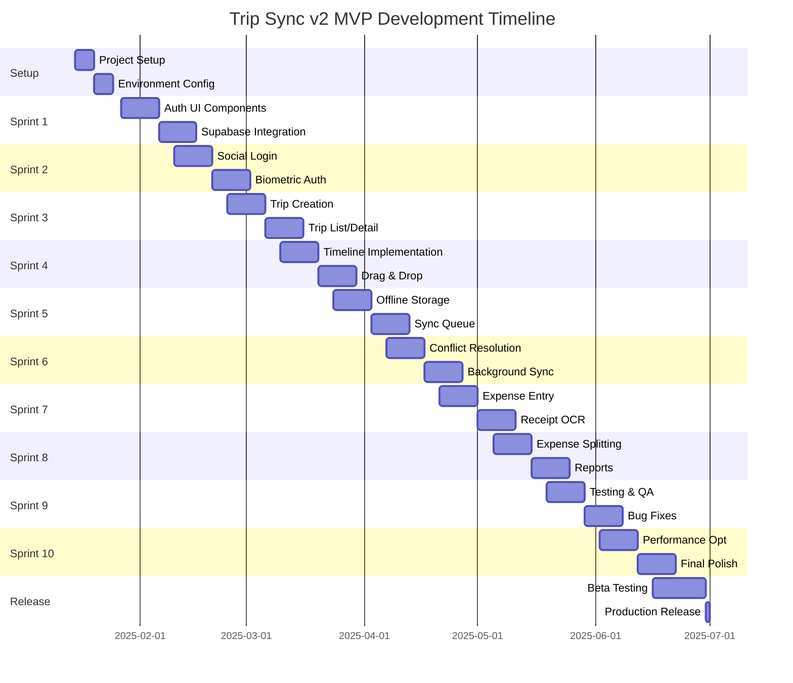

# Section 12: Epic Structure and Sprint Planning

## Epic Breakdown

```yaml
MVP_Release:
  Epic_1_Authentication:
    priority: P0
    duration: 2_sprints
    stories:
      - US001: Email/Password Registration (5 points)
      - US002: Social Login Integration (8 points)
      - US003: Biometric Authentication (5 points)
      - US004: Session Management (3 points)
      - US005: Password Recovery (3 points)
    
  Epic_2_Trip_Management:
    priority: P0
    duration: 3_sprints
    stories:
      - US010: Trip Creation Wizard (8 points)
      - US011: Trip List View (5 points)
      - US012: Trip Detail View (5 points)
      - US013: Trip Timeline (8 points)
      - US014: Trip Settings (3 points)
      - US015: Trip Sharing (5 points)
    
  Epic_3_Offline_Sync:
    priority: P0
    duration: 2_sprints
    stories:
      - US020: Offline Storage Setup (8 points)
      - US021: Sync Queue Implementation (8 points)
      - US022: Conflict Resolution (13 points)
      - US023: Background Sync (5 points)
    
  Epic_4_Expense_Tracking:
    priority: P1
    duration: 2_sprints
    stories:
      - US030: Expense Entry (5 points)
      - US031: Receipt Scanning (8 points)
      - US032: Expense Splitting (8 points)
      - US033: Currency Conversion (5 points)
      - US034: Expense Reports (5 points)
```

## Sprint Timeline



---
