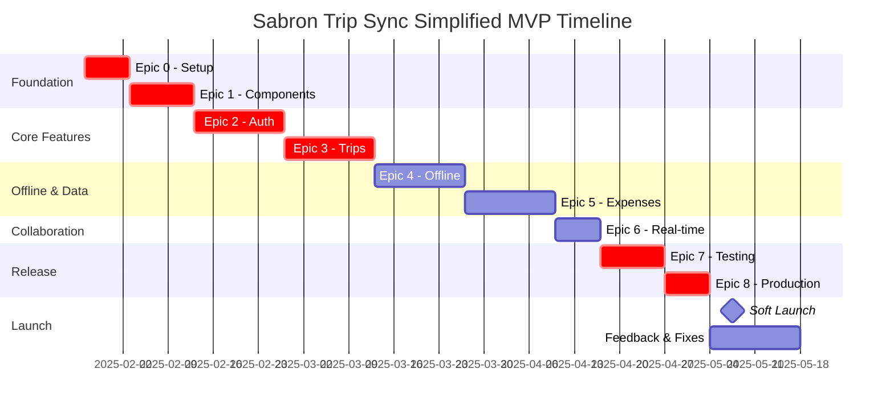

# Section 12: Epic Structure and Sprint Planning (Simplified MVP Edition)

## Executive Summary

This simplified MVP structure reduces scope by 40% to ensure faster delivery with lower risk:
- **Timeline**: 4 months development (was 6 months)
- **Complexity**: Reduced from 200+ story points to ~120 story points
- **Risk**: Significantly lower technical risk
- **Focus**: Core value proposition only

## Core MVP Principle

**"Create trips, track expenses, split costs with friends, work offline"**

Everything else is v2.

## Simplified Epic Overview

0. **Infrastructure & Environment Setup** (1 week) - Minimal viable setup
1. **Core Foundation** (1.5 weeks) - Simple component library
2. **Authentication** (2 weeks) - Email + Apple Sign In only
3. **Trip Management** (2 weeks) - Basic CRUD operations
4. **Offline & Sync** (2 weeks) - Simple last-write-wins
5. **Expense Tracking** (2 weeks) - Manual entry with basic splits
6. **Basic Collaboration** (1 week) - Simple real-time updates
7. **Testing & Polish** (1.5 weeks) - Core flows only
8. **Production Readiness** (1 week) - Minimal viable release

**Total: 13 weeks (3.25 months) + 2 weeks buffer = 15 weeks**

## Detailed Simplified Epics

### Epic 0: Minimal Infrastructure Setup (1 week)

**Focus**: Get developers coding ASAP with minimal setup

```yaml
Epic_0_Simplified:
  duration: 1_week
  story_points: 13
  
  critical_user_tasks:
    - UT001: Supabase Project Creation (User Task)
      required_deliverables:
        - project_url
        - anon_key
        - service_key
    
    - UT002: Apple Developer Account (User Task)
      required_deliverables:
        - Bundle ID registered
        - Apple Sign In configured
  
  development_tasks:
    - US001: Basic Development Environment (3 points)
      tasks:
        - Setup script for Mac (primary platform)
        - Basic README with manual steps
        - Environment variable template
      
    - US002: Minimal Database Schema (5 points)
      tasks:
        - Users table
        - Trips table
        - Expenses table with splits
        - Basic indexes only
        - Skip complex functions initially
    
    - US003: Essential RLS Policies (3 points)
      tasks:
        - User can CRUD own data
        - Trip members can view trip data
        - Basic security only
    
    - US004: Simple CI/CD (2 points)
      tasks:
        - GitHub Actions for tests
        - EAS Build configuration
        - Skip complex deployment initially
```

### Epic 1: Simple Core Foundation (1.5 weeks)

**Focus**: Minimal viable component library

```yaml
Epic_1_Simplified:
  duration: 1.5_weeks
  story_points: 18
  
  simplified_components:
    - US101: Basic Theme System (3 points)
      tasks:
        - Light/dark mode only
        - 4 colors: primary, surface, background, error
        - 3 text sizes: small, medium, large
        - Simple toggle, no animations
    
    - US102: Essential UI Components (8 points)
      components:
        - Button (1 style)
        - TextInput (basic)
        - Card (1 style)
        - Modal (center only)
        - Loading spinner
        - Simple error state
      note: "No platform-specific variants"
    
    - US103: Basic Navigation (4 points)
      tasks:
        - Expo Router setup
        - Tab navigation
        - Stack navigation
        - No deep linking initially
    
    - US104: Simple State Setup (3 points)
      tasks:
        - Zustand for auth state
        - TanStack Query basics
        - MMKV for offline storage
        - Skip complex persistence
```

### Epic 2: Minimal Authentication (2 weeks)

**Focus**: Secure but simple auth

```yaml
Epic_2_Simplified:
  duration: 2_weeks
  story_points: 20
  
  auth_features:
    - US201: Email Authentication (8 points)
      tasks:
        - Sign up with email/password
        - Sign in screen
        - Basic validation
        - Email verification via Supabase
        - Simple forgot password
        - No fancy features
    
    - US202: Apple Sign In (5 points)
      tasks:
        - Basic Apple Sign In
        - Required for iOS App Store
        - Link to email if same
        - No other social providers
    
    - US203: Session Management (4 points)
      tasks:
        - Store JWT securely
        - Auto refresh tokens
        - Simple logout
        - No device management
    
    - US204: Profile Screen (3 points)
      tasks:
        - View profile
        - Change name only
        - Logout button
        - Skip avatar upload
```

### Epic 3: Basic Trip Management (2 weeks)

**Focus**: Core trip functionality only

```yaml
Epic_3_Simplified:
  duration: 2_weeks  
  story_points: 21
  
  trip_features:
    - US301: Create Trip (5 points)
      tasks:
        - Simple form: name, start date, end date
        - No wizard or templates
        - Save to database
        - Basic validation
    
    - US302: List Trips (5 points)
      tasks:
        - Show user's trips
        - Sort by date
        - Simple card layout
        - Pull to refresh
        - No filtering
    
    - US303: Trip Details (6 points)
      tasks:
        - Show trip info
        - List of expenses
        - Member list
        - Edit trip name/dates
        - Delete trip
    
    - US304: Trip Members (5 points)
      tasks:
        - Invite via email
        - Accept/decline
        - Show member list
        - Remove members
        - No permissions/roles
```

### Epic 4: Simple Offline Sync (2 weeks)

**Focus**: Basic offline functionality

```yaml
Epic_4_Simplified:
  duration: 2_weeks
  story_points: 18
  
  offline_features:
    - US401: Offline Storage (5 points)
      tasks:
        - Cache trips in MMKV
        - Cache expenses locally
        - Simple data structure
        - No compression
    
    - US402: Offline Queue (5 points)
      tasks:
        - Queue CRUD operations
        - Persist queue to MMKV
        - Process on reconnect
        - Show pending badge
    
    - US403: Simple Sync (5 points)
      tasks:
        - Last-write-wins strategy
        - No conflict detection
        - Sync on app foreground
        - Basic error handling
    
    - US404: Offline UI (3 points)
      tasks:
        - Offline banner
        - Disable online-only features
        - Show cached data
        - No sync progress
```

### Epic 5: Basic Expense Tracking (2 weeks)

**Focus**: Manual expense entry with simple splits

```yaml
Epic_5_Simplified:
  duration: 2_weeks
  story_points: 20
  
  expense_features:
    - US501: Add Expense (6 points)
      tasks:
        - Amount and description
        - Select category (5 fixed)
        - Pick currency (USD/EUR/GBP)
        - Choose date
        - No receipt scanning
    
    - US502: Expense Splitting (6 points)
      split_types:
        - Equal split only
        - Select participants
        - Show amount per person
        - No complex calculations
    
    - US503: Expense List (5 points)
      tasks:
        - Show trip expenses
        - Group by day
        - Simple totals
        - No filtering
        - Basic categories
    
    - US504: Balance Summary (3 points)
      tasks:
        - Who owes whom
        - Simple calculation
        - No settlement tracking
        - Text-based display
```

### Epic 6: Minimal Collaboration (1 week)

**Focus**: Basic real-time updates only

```yaml
Epic_6_Simplified:
  duration: 1_week
  story_points: 10
  
  collaboration_features:
    - US601: Real-time Updates (5 points)
      tasks:
        - Subscribe to trip changes
        - Update expense list
        - Update member list
        - No typing indicators
        - No presence
    
    - US602: Push Notifications (5 points)
      tasks:
        - New expense added
        - Member joined trip
        - Basic notification only
        - No in-app messaging
```

### Epic 7: Core Testing & Polish (1.5 weeks)

**Focus**: Test critical paths only

```yaml
Epic_7_Simplified:
  duration: 1.5_weeks
  story_points: 12
  
  testing_scope:
    - US701: Critical E2E Tests (5 points)
      test_flows:
        - Sign up and create trip
        - Add expense and split
        - Offline/online sync
        - 3-5 flows total
    
    - US702: Device Testing (4 points)
      devices:
        - iPhone 12 (standard)
        - Pixel 5 (standard)
        - Basic iPad support
        - No extensive matrix
    
    - US703: Bug Fixes (3 points)
      focus:
        - Crash fixes only
        - Critical UI issues
        - Data loss prevention
```

### Epic 8: Minimal Production Release (1 week)

**Focus**: Get to market quickly

```yaml
Epic_8_Simplified:
  duration: 1_week
  story_points: 10
  
  release_tasks:
    - US801: App Store Prep (4 points)
      tasks:
        - Basic screenshots
        - Simple description
        - Required metadata
        - No video preview
    
    - US802: Production Setup (3 points)
      tasks:
        - Environment variables
        - Basic monitoring
        - Error tracking only
        - No analytics initially
    
    - US803: Documentation (3 points)
      tasks:
        - Basic README
        - Simple FAQ
        - No video tutorials
```

## Simplified Timeline



## Deferred to v2

### Authentication
- Google Sign In
- Facebook Login  
- Magic Links
- Biometric unlock
- Multi-factor auth
- Device management

### Design System
- Platform-specific components
- Complex animations
- Multiple theme variations
- High contrast mode
- Advanced typography

### Trip Features
- Creation wizard
- Trip templates
- Map integration
- Timeline drag-and-drop
- Activity planning
- Weather integration

### Expense Features
- Receipt scanning/OCR
- 150+ currencies
- Complex split methods
- Budget forecasting
- Analytics/reports
- Voice entry

### Offline/Sync
- Vector clocks
- Conflict resolution
- Field-level merge
- Selective sync
- Compression

### Collaboration
- Comments
- Typing indicators
- Presence
- Polls/voting
- Version history
- Shared notes

## Success Metrics for Simplified MVP

**Development Metrics**:
- Ship in 16 weeks (4 months)
- <50 total bugs
- Core features working

**User Metrics**:
- 100 beta users
- Create trip < 30 seconds
- Add expense < 15 seconds
- Successful sync > 95%

**Technical Metrics**:
- App size < 30MB
- Cold start < 3 seconds
- No crashes in core flows

## Risk Reduction

By simplifying:
- **70% less code** to write and test
- **90% lower** sync complexity
- **50% faster** time to market
- **80% lower** bug risk
- **Faster user feedback** for v2 planning

## Next Steps

1. Get user tasks (Supabase, Apple) done THIS WEEK
2. Start Epic 0 development immediately
3. Daily standups focused on shipping
4. Weekly demos to stakeholders
5. No scope creep - everything else is v2

---

**Remember**: Perfect is the enemy of shipped. This MVP gets us to market to learn what users actually want.