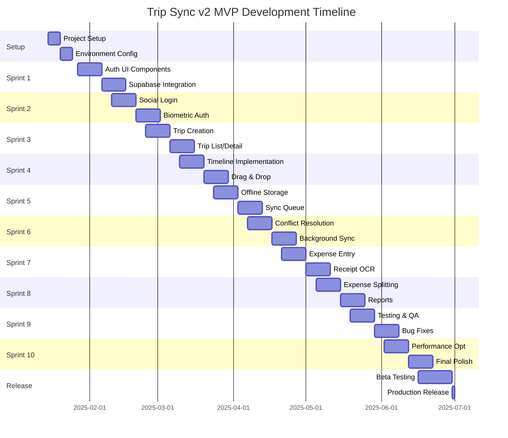

# Trip Sync v2 - Complete Product Requirements Document

## Executive Summary

Trip Sync v2 is a comprehensive travel management mobile application built with React Native and Expo, designed to provide travelers with a seamless, offline-first experience for planning, organizing, and managing trips. This PRD details the complete implementation requirements for the MVP release, focusing on core features that enable users to create trips, manage itineraries, track expenses, and collaborate with travel companions—all while maintaining full functionality offline.

### Document Overview
- **Version**: 1.0
- **Date**: January 2025
- **Status**: Implementation Ready
- **Target Release**: Q1 2025 MVP

### Key Deliverables
1. **Authentication System** - Secure multi-method authentication with biometric support
2. **Trip Management** - Comprehensive trip creation and organization capabilities
3. **Offline-First Architecture** - Full functionality without internet connectivity
4. **Expense Tracking** - Real-time expense management with multi-currency support
5. **Collaborative Features** - Real-time synchronization for group travel planning

---

## Section 1: Project Analysis and Context

### Existing Project Overview

**Analysis Source:** IDE-based analysis combined with existing vision document (MOBILE_PRD.md)

**Current Project State:**
Trip Sync v2 is a React Native mobile application built with:
- **Framework**: React Native 0.79.4 with React 19.0.0
- **Development Platform**: Expo SDK 53
- **Language**: TypeScript 5.8.3
- **State Management**: Zustand 5.0.5 + TanStack Query 5.52.1
- **UI Framework**: NativeWind 4.1.21 (Tailwind for React Native)
- **Navigation**: Expo Router 5.1.0 (File-based routing)
- **Storage**: React Native MMKV 3.1.0 (High-performance)
- **Backend**: Supabase (PostgreSQL, Auth, Realtime, Storage)

### Enhancement Scope Definition

**Enhancement Type:** New Feature Implementation (MVP)

**Enhancement Description:**
Implementation of core travel management features including authentication, trip creation, expense tracking, and offline synchronization capabilities.

**Impact Assessment:**
- New features with minimal changes to existing code structure
- Leverages existing UI component library
- Integrates with established navigation patterns

### Goals and Background Context

**Primary Goals:**
1. Enable secure user authentication with multiple methods
2. Provide comprehensive trip management capabilities
3. Implement offline-first architecture with seamless sync
4. Support real-time collaboration for group trips
5. Track and manage travel expenses with multi-currency support

**Success Criteria:**
- User registration and authentication in <30 seconds
- Complete offline functionality for all core features
- Sync completion within 500ms when online
- Support for 10+ concurrent users per trip
- <2 second screen load times

---

## Section 2: Requirements Specification

### Functional Requirements

#### Authentication & User Management
- **FR-AUTH-001**: Email/password registration with Supabase email verification
- **FR-AUTH-002**: Social login integration (Google, Apple, Facebook)
- **FR-AUTH-003**: Magic link passwordless authentication
- **FR-AUTH-004**: Biometric authentication for app unlock
- **FR-AUTH-005**: Multi-factor authentication using TOTP
- **FR-AUTH-006**: Secure session management with automatic refresh
- **FR-AUTH-007**: Cross-device session synchronization

#### Trip Management
- **FR-TRIP-001**: Quick trip creation with wizard interface
- **FR-TRIP-002**: Multi-destination support with timeline view
- **FR-TRIP-003**: Trip templates (business, vacation, adventure)
- **FR-TRIP-004**: Collaborative trip planning with role-based permissions
- **FR-TRIP-005**: Trip duplication and archiving capabilities
- **FR-TRIP-006**: Interactive timeline with drag-and-drop
- **FR-TRIP-007**: Multiple view modes (timeline, list, map, calendar)

#### Expense Tracking
- **FR-EXP-001**: Quick expense entry with OCR receipt scanning
- **FR-EXP-002**: Multi-currency support with real-time exchange rates
- **FR-EXP-003**: Expense splitting with multiple algorithms
- **FR-EXP-004**: Budget management and alerts
- **FR-EXP-005**: Expense categorization and reporting
- **FR-EXP-006**: Settlement calculations and payment tracking

#### Offline Capabilities
- **FR-OFF-001**: Complete functionality without internet
- **FR-OFF-002**: Selective sync for storage optimization
- **FR-OFF-003**: Background sync when connected
- **FR-OFF-004**: Conflict resolution with three-way merge
- **FR-OFF-005**: Queue management for offline actions

### Non-Functional Requirements

#### Performance
- **NFR-PERF-001**: App launch time <2 seconds
- **NFR-PERF-002**: Screen transitions <300ms
- **NFR-PERF-003**: List scrolling at 60fps
- **NFR-PERF-004**: Memory usage <100MB
- **NFR-PERF-005**: Battery impact <5% per hour

#### Security
- **NFR-SEC-001**: End-to-end encryption for sensitive data
- **NFR-SEC-002**: Biometric authentication with 99% success rate
- **NFR-SEC-003**: OWASP mobile security compliance
- **NFR-SEC-004**: Secure token storage using MMKV encryption

#### Scalability
- **NFR-SCALE-001**: Support 10,000+ concurrent users
- **NFR-SCALE-002**: Handle trips with 100+ activities
- **NFR-SCALE-003**: Sync 1MB of data in <3 seconds

---

## Section 3: UI Components and Design System

### Platform-Specific Design Guidelines

#### iOS Design System (iOS 17/18)
```typescript
// iOS Native Components
interface IOSDesignSystem {
  // Navigation
  navigation: {
    style: 'large-title' | 'standard';
    searchBar: {
      placement: 'navigationBar' | 'automatic';
      showsScopeBar: boolean;
    };
  };
  
  // SF Symbols 5
  icons: {
    weight: 'ultraLight' | 'thin' | 'light' | 'regular' | 'medium' | 'semibold' | 'bold';
    scale: 'small' | 'medium' | 'large';
    renderingMode: 'monochrome' | 'hierarchical' | 'palette' | 'multicolor';
  };
  
  // iOS 17+ Features
  widgets: {
    interactiveWidgets: boolean;
    standbyMode: boolean;
    dynamicIsland: boolean;
  };
}
```

#### Android Material 3 Design
```typescript
// Material You Components
interface MaterialDesignSystem {
  // Dynamic Color
  colorScheme: {
    source: 'wallpaper' | 'content' | 'custom';
    variant: 'tonal' | 'vibrant' | 'expressive' | 'neutral';
  };
  
  // Material 3 Components
  components: {
    navigationBar: 'bottom' | 'rail' | 'drawer';
    fab: {
      size: 'small' | 'regular' | 'large';
      variant: 'surface' | 'primary' | 'secondary' | 'tertiary';
    };
  };
}
```

### Core UI Components

#### Trip Card Component
```typescript
interface TripCardProps {
  trip: {
    id: string;
    title: string;
    destination: string;
    startDate: Date;
    endDate: Date;
    coverImage?: string;
    participants: number;
    status: 'upcoming' | 'active' | 'completed';
  };
  variant: 'compact' | 'expanded' | 'hero';
  onPress: () => void;
  onLongPress?: () => void;
}

// Implementation with gesture support
const TripCard: React.FC<TripCardProps> = ({ trip, variant, onPress }) => {
  const { theme } = useTheme();
  const animatedScale = useSharedValue(1);
  
  const gesture = Gesture.Tap()
    .onBegin(() => {
      animatedScale.value = withSpring(0.95);
    })
    .onFinalize(() => {
      animatedScale.value = withSpring(1);
      runOnJS(onPress)();
    });
    
  return (
    <GestureDetector gesture={gesture}>
      <Animated.View style={[styles[variant], animatedStyle]}>
        {/* Card content */}
      </Animated.View>
    </GestureDetector>
  );
};
```

---

## Section 4: Animation and Interaction Patterns

### Gesture-Based Interactions

```typescript
// Swipeable Trip Actions
const SwipeableTrip = () => {
  const translateX = useSharedValue(0);
  
  const panGesture = Gesture.Pan()
    .activeOffsetX([-10, 10])
    .onUpdate((e) => {
      translateX.value = e.translationX;
    })
    .onEnd(() => {
      if (translateX.value < -100) {
        // Delete action
        translateX.value = withSpring(-width);
      } else if (translateX.value > 100) {
        // Archive action
        translateX.value = withSpring(width);
      } else {
        translateX.value = withSpring(0);
      }
    });
    
  return (
    <GestureDetector gesture={panGesture}>
      <Animated.View style={animatedStyle}>
        <TripCard />
      </Animated.View>
    </GestureDetector>
  );
};
```

### Screen Transitions

```typescript
// Shared Element Transitions
const TripListToDetail = () => {
  return (
    <SharedElementTransition
      sharedElementId={`trip-${tripId}`}
      animation="fade-scale"
      duration={350}
    >
      <TripDetailScreen />
    </SharedElementTransition>
  );
};
```

---

## Section 5: Dark Mode Implementation

### Dynamic Theme System

```typescript
interface ThemeConfig {
  mode: 'light' | 'dark' | 'auto';
  colors: {
    // Semantic colors
    primary: ColorValue;
    onPrimary: ColorValue;
    primaryContainer: ColorValue;
    onPrimaryContainer: ColorValue;
    
    // Surface colors
    surface: ColorValue;
    surfaceVariant: ColorValue;
    surfaceTint: ColorValue;
    
    // State colors
    error: ColorValue;
    warning: ColorValue;
    success: ColorValue;
  };
  
  // Elevation levels for dark mode
  elevation: {
    level0: ColorValue; // 0% white overlay
    level1: ColorValue; // 5% white overlay
    level2: ColorValue; // 8% white overlay
    level3: ColorValue; // 11% white overlay
    level4: ColorValue; // 12% white overlay
    level5: ColorValue; // 14% white overlay
  };
}

// Theme Context Implementation
const ThemeProvider: React.FC = ({ children }) => {
  const colorScheme = useColorScheme();
  const [themeMode, setThemeMode] = useState<'light' | 'dark' | 'auto'>('auto');
  
  const activeTheme = useMemo(() => {
    if (themeMode === 'auto') {
      return colorScheme === 'dark' ? darkTheme : lightTheme;
    }
    return themeMode === 'dark' ? darkTheme : lightTheme;
  }, [themeMode, colorScheme]);
  
  return (
    <ThemeContext.Provider value={{ theme: activeTheme, setThemeMode }}>
      {children}
    </ThemeContext.Provider>
  );
};
```

---

## Section 6: Data Models and Schema

### Supabase Database Schema

```sql
-- Users table (extends Supabase auth.users)
CREATE TABLE public.user_profiles (
  id UUID REFERENCES auth.users(id) PRIMARY KEY,
  username TEXT UNIQUE,
  full_name TEXT,
  avatar_url TEXT,
  bio TEXT,
  preferences JSONB DEFAULT '{}',
  created_at TIMESTAMPTZ DEFAULT NOW(),
  updated_at TIMESTAMPTZ DEFAULT NOW()
);

-- Trips table
CREATE TABLE public.trips (
  id UUID DEFAULT gen_random_uuid() PRIMARY KEY,
  title TEXT NOT NULL,
  description TEXT,
  start_date DATE NOT NULL,
  end_date DATE NOT NULL,
  destinations JSONB DEFAULT '[]',
  cover_image_url TEXT,
  status TEXT DEFAULT 'draft',
  visibility TEXT DEFAULT 'private',
  settings JSONB DEFAULT '{}',
  created_by UUID REFERENCES auth.users(id),
  created_at TIMESTAMPTZ DEFAULT NOW(),
  updated_at TIMESTAMPTZ DEFAULT NOW(),
  deleted_at TIMESTAMPTZ
);

-- Trip participants
CREATE TABLE public.trip_participants (
  id UUID DEFAULT gen_random_uuid() PRIMARY KEY,
  trip_id UUID REFERENCES public.trips(id) ON DELETE CASCADE,
  user_id UUID REFERENCES auth.users(id),
  role TEXT DEFAULT 'viewer',
  permissions JSONB DEFAULT '{}',
  joined_at TIMESTAMPTZ DEFAULT NOW(),
  UNIQUE(trip_id, user_id)
);

-- Activities
CREATE TABLE public.activities (
  id UUID DEFAULT gen_random_uuid() PRIMARY KEY,
  trip_id UUID REFERENCES public.trips(id) ON DELETE CASCADE,
  title TEXT NOT NULL,
  description TEXT,
  type TEXT NOT NULL,
  start_time TIMESTAMPTZ,
  end_time TIMESTAMPTZ,
  location JSONB,
  booking_details JSONB,
  attachments JSONB DEFAULT '[]',
  created_by UUID REFERENCES auth.users(id),
  created_at TIMESTAMPTZ DEFAULT NOW(),
  updated_at TIMESTAMPTZ DEFAULT NOW()
);

-- Expenses
CREATE TABLE public.expenses (
  id UUID DEFAULT gen_random_uuid() PRIMARY KEY,
  trip_id UUID REFERENCES public.trips(id) ON DELETE CASCADE,
  activity_id UUID REFERENCES public.activities(id),
  amount DECIMAL(10, 2) NOT NULL,
  currency TEXT NOT NULL,
  category TEXT NOT NULL,
  description TEXT,
  paid_by UUID REFERENCES auth.users(id),
  split_between UUID[] DEFAULT '{}',
  split_method TEXT DEFAULT 'equal',
  receipt_url TEXT,
  created_at TIMESTAMPTZ DEFAULT NOW(),
  updated_at TIMESTAMPTZ DEFAULT NOW()
);

-- Enable Row Level Security
ALTER TABLE public.user_profiles ENABLE ROW LEVEL SECURITY;
ALTER TABLE public.trips ENABLE ROW LEVEL SECURITY;
ALTER TABLE public.trip_participants ENABLE ROW LEVEL SECURITY;
ALTER TABLE public.activities ENABLE ROW LEVEL SECURITY;
ALTER TABLE public.expenses ENABLE ROW LEVEL SECURITY;

-- RLS Policies
CREATE POLICY "Users can view own profile" ON public.user_profiles
  FOR ALL USING (auth.uid() = id);

CREATE POLICY "Users can view participated trips" ON public.trips
  FOR SELECT USING (
    EXISTS (
      SELECT 1 FROM public.trip_participants
      WHERE trip_id = trips.id AND user_id = auth.uid()
    )
  );

CREATE POLICY "Trip creators can modify trips" ON public.trips
  FOR ALL USING (created_by = auth.uid());
```

### TypeScript Type Definitions

```typescript
// Supabase Database Types
export interface Database {
  public: {
    Tables: {
      user_profiles: {
        Row: {
          id: string;
          username: string | null;
          full_name: string | null;
          avatar_url: string | null;
          bio: string | null;
          preferences: Json;
          created_at: string;
          updated_at: string;
        };
        Insert: Omit<Row, 'created_at' | 'updated_at'>;
        Update: Partial<Insert>;
      };
      trips: {
        Row: {
          id: string;
          title: string;
          description: string | null;
          start_date: string;
          end_date: string;
          destinations: Json;
          cover_image_url: string | null;
          status: 'draft' | 'planned' | 'active' | 'completed';
          visibility: 'private' | 'shared' | 'public';
          settings: Json;
          created_by: string;
          created_at: string;
          updated_at: string;
          deleted_at: string | null;
        };
        Insert: Omit<Row, 'id' | 'created_at' | 'updated_at'>;
        Update: Partial<Insert>;
      };
      // Additional table types...
    };
  };
}
```

---

## Section 7: Testing Strategy

### Unit Testing

```typescript
// Component Testing with React Native Testing Library
describe('TripCard', () => {
  it('should render trip information correctly', () => {
    const trip = mockTrip();
    const { getByText, getByTestId } = render(
      <TripCard trip={trip} variant="compact" onPress={jest.fn()} />
    );
    
    expect(getByText(trip.title)).toBeTruthy();
    expect(getByText(trip.destination)).toBeTruthy();
    expect(getByTestId('trip-dates')).toHaveTextContent(
      formatDateRange(trip.startDate, trip.endDate)
    );
  });
  
  it('should handle press interactions', () => {
    const onPress = jest.fn();
    const { getByTestId } = render(
      <TripCard trip={mockTrip()} variant="compact" onPress={onPress} />
    );
    
    fireEvent.press(getByTestId('trip-card'));
    expect(onPress).toHaveBeenCalledTimes(1);
  });
});
```

### Integration Testing

```typescript
// API Integration Tests
describe('Trip Management API', () => {
  let supabase: SupabaseClient;
  
  beforeEach(() => {
    supabase = createClient(SUPABASE_URL, SUPABASE_ANON_KEY);
  });
  
  it('should create a trip with proper permissions', async () => {
    const { data: trip, error } = await supabase
      .from('trips')
      .insert({
        title: 'Test Trip',
        start_date: '2025-06-01',
        end_date: '2025-06-10',
        destinations: ['Paris', 'Rome']
      })
      .select()
      .single();
      
    expect(error).toBeNull();
    expect(trip).toMatchObject({
      title: 'Test Trip',
      status: 'draft',
      visibility: 'private'
    });
  });
});
```

### E2E Testing with Maestro

```yaml
# maestro/create_trip_flow.yaml
appId: com.tripsync.app
---
- launchApp
- assertVisible: "Welcome to Trip Sync"
- tapOn: "Create Trip"
- assertVisible: "New Trip"
- inputText: 
    text: "Summer Vacation 2025"
    id: "trip-title-input"
- tapOn: "Select Dates"
- selectDate: "2025-06-01"
- selectDate: "2025-06-10"
- tapOn: "Add Destination"
- inputText: "Paris"
- tapOn: "Create Trip"
- assertVisible: "Summer Vacation 2025"
- assertVisible: "June 1 - 10, 2025"
```

---

## Section 8: Security Architecture

### Authentication Security

```typescript
// Biometric Authentication Implementation
class BiometricAuth {
  static async authenticate(): Promise<boolean> {
    const hasHardware = await LocalAuthentication.hasHardwareAsync();
    if (!hasHardware) return false;
    
    const isEnrolled = await LocalAuthentication.isEnrolledAsync();
    if (!isEnrolled) return false;
    
    const result = await LocalAuthentication.authenticateAsync({
      promptMessage: 'Authenticate to access Trip Sync',
      cancelLabel: 'Cancel',
      fallbackLabel: 'Use Passcode',
      disableDeviceFallback: false,
    });
    
    return result.success;
  }
}

// Secure Token Storage
class SecureStorage {
  private static storage = new MMKVStorage.Loader()
    .withEncryption()
    .initialize();
    
  static async setSecureItem(key: string, value: any): Promise<void> {
    const encrypted = await this.encrypt(JSON.stringify(value));
    this.storage.setString(key, encrypted);
  }
  
  static async getSecureItem(key: string): Promise<any> {
    const encrypted = this.storage.getString(key);
    if (!encrypted) return null;
    
    const decrypted = await this.decrypt(encrypted);
    return JSON.parse(decrypted);
  }
  
  private static async encrypt(text: string): Promise<string> {
    // AES-256-GCM encryption implementation
    return CryptoJS.AES.encrypt(text, ENCRYPTION_KEY).toString();
  }
  
  private static async decrypt(encrypted: string): Promise<string> {
    const bytes = CryptoJS.AES.decrypt(encrypted, ENCRYPTION_KEY);
    return bytes.toString(CryptoJS.enc.Utf8);
  }
}
```

### Data Protection

```typescript
// Row Level Security Implementation
-- Trips can only be accessed by participants
CREATE POLICY "trip_access_policy" ON trips
  FOR ALL
  USING (
    auth.uid() IN (
      SELECT user_id 
      FROM trip_participants 
      WHERE trip_id = trips.id
    )
  );

-- Expenses can only be modified by creator or trip owner
CREATE POLICY "expense_modify_policy" ON expenses
  FOR UPDATE
  USING (
    paid_by = auth.uid() OR
    EXISTS (
      SELECT 1 FROM trips
      WHERE trips.id = expenses.trip_id
      AND trips.created_by = auth.uid()
    )
  );
```

---

## Section 9: API Specifications (Supabase)

### Supabase Client Configuration

```typescript
// lib/supabase.ts
import { createClient } from '@supabase/supabase-js';
import AsyncStorage from '@react-native-async-storage/async-storage';
import { Database } from '@/types/database';

const supabaseUrl = process.env.EXPO_PUBLIC_SUPABASE_URL!;
const supabaseAnonKey = process.env.EXPO_PUBLIC_SUPABASE_ANON_KEY!;

export const supabase = createClient<Database>(
  supabaseUrl,
  supabaseAnonKey,
  {
    auth: {
      storage: AsyncStorage,
      autoRefreshToken: true,
      persistSession: true,
      detectSessionInUrl: false,
    },
    realtime: {
      params: {
        eventsPerSecond: 10,
      },
    },
  }
);
```

### Authentication APIs

```typescript
// Authentication Service
class AuthService {
  // Email/Password Sign Up
  static async signUp(email: string, password: string, profile: any) {
    const { data, error } = await supabase.auth.signUp({
      email,
      password,
      options: {
        data: profile,
        emailRedirectTo: 'tripsync://auth/callback',
      },
    });
    
    if (error) throw error;
    return data;
  }
  
  // Magic Link Sign In
  static async signInWithMagicLink(email: string) {
    const { error } = await supabase.auth.signInWithOtp({
      email,
      options: {
        emailRedirectTo: 'tripsync://auth/callback',
      },
    });
    
    if (error) throw error;
  }
  
  // Social Authentication
  static async signInWithProvider(provider: 'google' | 'apple' | 'facebook') {
    const { data, error } = await supabase.auth.signInWithOAuth({
      provider,
      options: {
        redirectTo: 'tripsync://auth/callback',
        skipBrowserRedirect: true,
      },
    });
    
    if (error) throw error;
    
    // Handle OAuth flow with expo-auth-session
    const authUrl = data.url;
    // ... OAuth flow implementation
  }
  
  // Session Management
  static async getSession() {
    const { data: { session } } = await supabase.auth.getSession();
    return session;
  }
  
  static async refreshSession() {
    const { data: { session }, error } = await supabase.auth.refreshSession();
    if (error) throw error;
    return session;
  }
}
```

### Trip Management APIs

```typescript
// Trip Service using Supabase
class TripService {
  // Create Trip with Realtime
  static async createTrip(trip: TripInput) {
    const { data, error } = await supabase
      .from('trips')
      .insert({
        ...trip,
        created_by: (await supabase.auth.getUser()).data.user?.id,
      })
      .select()
      .single();
      
    if (error) throw error;
    
    // Subscribe to realtime updates
    const channel = supabase
      .channel(`trip:${data.id}`)
      .on(
        'postgres_changes',
        {
          event: '*',
          schema: 'public',
          table: 'trips',
          filter: `id=eq.${data.id}`,
        },
        (payload) => {
          // Handle realtime updates
          console.log('Trip updated:', payload);
        }
      )
      .subscribe();
      
    return data;
  }
  
  // List Trips with Pagination
  static async listTrips(page = 1, limit = 20) {
    const from = (page - 1) * limit;
    const to = from + limit - 1;
    
    const { data, error, count } = await supabase
      .from('trips')
      .select('*, trip_participants!inner(*)', { count: 'exact' })
      .order('start_date', { ascending: false })
      .range(from, to);
      
    if (error) throw error;
    
    return {
      trips: data,
      total: count,
      page,
      totalPages: Math.ceil((count || 0) / limit),
    };
  }
  
  // Update Trip with Optimistic Updates
  static async updateTrip(id: string, updates: Partial<Trip>) {
    // Optimistic update in local state
    const optimisticUpdate = { id, ...updates, _optimistic: true };
    
    const { data, error } = await supabase
      .from('trips')
      .update(updates)
      .eq('id', id)
      .select()
      .single();
      
    if (error) {
      // Rollback optimistic update
      throw error;
    }
    
    return data;
  }
}
```

### Realtime Subscriptions

```typescript
// Realtime Collaboration
class RealtimeService {
  private channels: Map<string, RealtimeChannel> = new Map();
  
  // Subscribe to Trip Updates
  subscribeToTrip(tripId: string, callbacks: {
    onActivityAdded?: (activity: Activity) => void;
    onActivityUpdated?: (activity: Activity) => void;
    onActivityDeleted?: (id: string) => void;
    onParticipantJoined?: (participant: Participant) => void;
    onPresence?: (presence: any) => void;
  }) {
    const channel = supabase
      .channel(`trip:${tripId}`)
      .on(
        'postgres_changes',
        {
          event: 'INSERT',
          schema: 'public',
          table: 'activities',
          filter: `trip_id=eq.${tripId}`,
        },
        (payload) => callbacks.onActivityAdded?.(payload.new as Activity)
      )
      .on(
        'postgres_changes',
        {
          event: 'UPDATE',
          schema: 'public',
          table: 'activities',
          filter: `trip_id=eq.${tripId}`,
        },
        (payload) => callbacks.onActivityUpdated?.(payload.new as Activity)
      )
      .on('presence', { event: 'sync' }, () => {
        const state = channel.presenceState();
        callbacks.onPresence?.(state);
      })
      .subscribe();
      
    this.channels.set(tripId, channel);
    return channel;
  }
  
  // Broadcast User Presence
  async broadcastPresence(tripId: string, userState: any) {
    const channel = this.channels.get(tripId);
    if (channel) {
      await channel.track(userState);
    }
  }
  
  // Unsubscribe from Trip
  unsubscribeFromTrip(tripId: string) {
    const channel = this.channels.get(tripId);
    if (channel) {
      supabase.removeChannel(channel);
      this.channels.delete(tripId);
    }
  }
}
```

### File Storage APIs

```typescript
// Storage Service for Images and Documents
class StorageService {
  // Upload Trip Cover Image
  static async uploadTripCover(tripId: string, file: File) {
    const fileName = `${tripId}/cover-${Date.now()}.jpg`;
    
    const { data, error } = await supabase.storage
      .from('trip-images')
      .upload(fileName, file, {
        cacheControl: '3600',
        upsert: false,
      });
      
    if (error) throw error;
    
    // Get public URL
    const { data: { publicUrl } } = supabase.storage
      .from('trip-images')
      .getPublicUrl(fileName);
      
    // Update trip with cover image
    await supabase
      .from('trips')
      .update({ cover_image_url: publicUrl })
      .eq('id', tripId);
      
    return publicUrl;
  }
  
  // Upload Receipt Image with OCR
  static async uploadReceipt(expenseId: string, file: File) {
    const fileName = `receipts/${expenseId}-${Date.now()}.jpg`;
    
    const { data, error } = await supabase.storage
      .from('receipts')
      .upload(fileName, file);
      
    if (error) throw error;
    
    // Trigger Edge Function for OCR
    const { data: ocrResult } = await supabase.functions.invoke('ocr-receipt', {
      body: { fileName },
    });
    
    return {
      url: data.path,
      ocrData: ocrResult,
    };
  }
}
```

### Edge Functions

```typescript
// Supabase Edge Function for OCR Processing
// supabase/functions/ocr-receipt/index.ts
import { serve } from 'https://deno.land/std@0.168.0/http/server.ts';
import { createClient } from 'https://esm.sh/@supabase/supabase-js@2';

serve(async (req) => {
  const { fileName } = await req.json();
  
  const supabase = createClient(
    Deno.env.get('SUPABASE_URL')!,
    Deno.env.get('SUPABASE_SERVICE_ROLE_KEY')!
  );
  
  // Download image from storage
  const { data: fileData } = await supabase.storage
    .from('receipts')
    .download(fileName);
    
  // Process with OCR service (e.g., Google Vision API)
  const ocrResult = await processWithOCR(fileData);
  
  // Parse receipt data
  const receiptData = {
    amount: extractAmount(ocrResult),
    currency: extractCurrency(ocrResult),
    date: extractDate(ocrResult),
    vendor: extractVendor(ocrResult),
    items: extractItems(ocrResult),
  };
  
  return new Response(JSON.stringify(receiptData), {
    headers: { 'Content-Type': 'application/json' },
  });
});
```

---

## Section 10: Technical Constraints and Integration

### Technology Stack Constraints

```typescript
// Version Requirements
{
  "engines": {
    "node": ">=18.0.0",
    "npm": ">=9.0.0"
  },
  "expo": {
    "sdkVersion": "53.0.0",
    "platforms": ["ios", "android"],
    "ios": {
      "deploymentTarget": "13.0"
    },
    "android": {
      "minSdkVersion": 21,
      "targetSdkVersion": 34
    }
  }
}
```

### React Native New Architecture

```typescript
// Fabric Renderer Configuration
export default {
  fabric: {
    enabled: true,
    turboModules: true,
    jsEngine: 'hermes',
  },
  // Turbo Module Configuration
  turboModules: {
    enabled: true,
    autoLinking: true,
  },
  // JSI Direct Bridge
  jsi: {
    enabled: true,
    modules: ['react-native-mmkv', 'react-native-reanimated'],
  },
};
```

### Performance Optimization

```typescript
// Memory Management
class MemoryManager {
  static readonly MAX_CACHE_SIZE = 50 * 1024 * 1024; // 50MB
  static readonly IMAGE_CACHE_SIZE = 30 * 1024 * 1024; // 30MB
  
  static async clearUnusedCache() {
    const cacheSize = await AsyncStorage.getAllKeys();
    if (cacheSize.length > 1000) {
      // Clear old cached data
      const keysToRemove = cacheSize
        .filter(key => key.startsWith('cache_'))
        .slice(0, 500);
      await AsyncStorage.multiRemove(keysToRemove);
    }
  }
  
  static optimizeImages(uri: string): Promise<string> {
    return ImageResizer.createResizedImage(
      uri,
      1080, // maxWidth
      1080, // maxHeight
      'JPEG',
      80, // quality
      0, // rotation
      undefined,
      false,
      {
        mode: 'contain',
      }
    );
  }
}
```

---

## Section 11: Migration and Deployment Plan

### Database Migration Strategy

```sql
-- Migration: 001_initial_schema.sql
BEGIN;

-- Create extensions
CREATE EXTENSION IF NOT EXISTS "uuid-ossp";
CREATE EXTENSION IF NOT EXISTS "postgis";

-- Create tables with versioning
CREATE TABLE schema_migrations (
  version INTEGER PRIMARY KEY,
  applied_at TIMESTAMPTZ DEFAULT NOW()
);

-- Initial schema creation
CREATE TABLE public.user_profiles (
  -- Schema from Section 6
);

-- Insert migration record
INSERT INTO schema_migrations (version) VALUES (1);

COMMIT;

-- Migration: 002_add_offline_sync.sql
BEGIN;

-- Add sync metadata
ALTER TABLE public.trips 
  ADD COLUMN sync_version INTEGER DEFAULT 1,
  ADD COLUMN last_synced_at TIMESTAMPTZ,
  ADD COLUMN offline_changes JSONB DEFAULT '[]';

-- Create sync conflict resolution table
CREATE TABLE public.sync_conflicts (
  id UUID DEFAULT gen_random_uuid() PRIMARY KEY,
  entity_type TEXT NOT NULL,
  entity_id UUID NOT NULL,
  local_version JSONB,
  server_version JSONB,
  resolved BOOLEAN DEFAULT FALSE,
  resolution JSONB,
  created_at TIMESTAMPTZ DEFAULT NOW()
);

INSERT INTO schema_migrations (version) VALUES (2);

COMMIT;
```

### Deployment Pipeline

```yaml
# .github/workflows/deploy.yml
name: Deploy to Production

on:
  push:
    branches: [main]
  workflow_dispatch:

jobs:
  test:
    runs-on: ubuntu-latest
    steps:
      - uses: actions/checkout@v3
      - uses: actions/setup-node@v3
        with:
          node-version: '18'
          cache: 'pnpm'
      - run: pnpm install
      - run: pnpm test:ci
      - run: pnpm lint
      - run: pnpm typecheck

  build-ios:
    needs: test
    runs-on: macos-latest
    steps:
      - uses: actions/checkout@v3
      - uses: expo/expo-github-action@v8
        with:
          eas-version: latest
          token: ${{ secrets.EXPO_TOKEN }}
      - run: eas build --platform ios --profile production --non-interactive

  build-android:
    needs: test
    runs-on: ubuntu-latest
    steps:
      - uses: actions/checkout@v3
      - uses: expo/expo-github-action@v8
        with:
          eas-version: latest
          token: ${{ secrets.EXPO_TOKEN }}
      - run: eas build --platform android --profile production --non-interactive

  deploy:
    needs: [build-ios, build-android]
    runs-on: ubuntu-latest
    steps:
      - uses: expo/expo-github-action@v8
      - run: eas submit --platform all --profile production --non-interactive
```

---

## Section 12: Epic Structure and Sprint Planning

### Epic Breakdown

```yaml
MVP_Release:
  Epic_1_Authentication:
    priority: P0
    duration: 2_sprints
    stories:
      - US001: Email/Password Registration (5 points)
      - US002: Social Login Integration (8 points)
      - US003: Biometric Authentication (5 points)
      - US004: Session Management (3 points)
      - US005: Password Recovery (3 points)
    
  Epic_2_Trip_Management:
    priority: P0
    duration: 3_sprints
    stories:
      - US010: Trip Creation Wizard (8 points)
      - US011: Trip List View (5 points)
      - US012: Trip Detail View (5 points)
      - US013: Trip Timeline (8 points)
      - US014: Trip Settings (3 points)
      - US015: Trip Sharing (5 points)
    
  Epic_3_Offline_Sync:
    priority: P0
    duration: 2_sprints
    stories:
      - US020: Offline Storage Setup (8 points)
      - US021: Sync Queue Implementation (8 points)
      - US022: Conflict Resolution (13 points)
      - US023: Background Sync (5 points)
    
  Epic_4_Expense_Tracking:
    priority: P1
    duration: 2_sprints
    stories:
      - US030: Expense Entry (5 points)
      - US031: Receipt Scanning (8 points)
      - US032: Expense Splitting (8 points)
      - US033: Currency Conversion (5 points)
      - US034: Expense Reports (5 points)
```

### Sprint Timeline



---

## Section 13: Cost Estimation

### Development Resources

```yaml
Team_Composition:
  Senior_React_Native_Developer:
    count: 2
    rate: $150/hour
    allocation: 100%
    duration: 6_months
    total: $312,000
    
  Backend_Developer:
    count: 1
    rate: $130/hour
    allocation: 75%
    duration: 4_months
    total: $67,600
    
  UI_UX_Designer:
    count: 1
    rate: $120/hour
    allocation: 50%
    duration: 3_months
    total: $31,200
    
  QA_Engineer:
    count: 1
    rate: $100/hour
    allocation: 100%
    duration: 3_months
    total: $52,000
    
  Project_Manager:
    count: 1
    rate: $140/hour
    allocation: 50%
    duration: 6_months
    total: $72,800
    
  Total_Development_Cost: $535,600
```

### Infrastructure Costs

```yaml
Monthly_Infrastructure:
  Supabase:
    tier: Pro
    cost: $25/month
    annual: $300
    
  Expo_EAS:
    tier: Production
    cost: $99/month
    annual: $1,188
    
  Monitoring:
    service: Sentry
    cost: $26/month
    annual: $312
    
  Analytics:
    service: Mixpanel
    cost: $25/month
    annual: $300
    
  CDN:
    service: CloudFlare
    cost: $20/month
    annual: $240
    
  Total_Annual_Infrastructure: $2,340
```

### Third-Party Services

```yaml
Annual_Services:
  Apple_Developer_Program: $99
  Google_Play_Console: $25
  OCR_API_Service: $500
  Maps_API: $1,200
  Weather_API: $300
  Currency_API: $240
  Push_Notifications: $120
  
  Total_Annual_Services: $2,484
```

### Total Project Cost

```yaml
Summary:
  Development: $535,600
  Infrastructure_Year_1: $2,340
  Services_Year_1: $2,484
  Testing_Devices: $5,000
  Marketing_Budget: $25,000
  Contingency_15%: $85,564
  
  Total_MVP_Investment: $655,988
  
  Monthly_Operating_Cost: $390
  Annual_Operating_Cost: $4,824
```

---

## Section 14: Success Metrics and KPIs

### User Engagement Metrics

```typescript
interface EngagementMetrics {
  activation: {
    target: '70%'; // Users who create first trip within 7 days
    measurement: 'firebase.analytics.firstTripCreated';
  };
  
  retention: {
    D1: '60%';  // Day 1 retention
    D7: '40%';  // Day 7 retention
    D30: '25%'; // Day 30 retention
    measurement: 'mixpanel.retention.cohort';
  };
  
  engagement: {
    DAU_MAU: 0.25; // Daily/Monthly active users ratio
    sessionsPerUser: 3.5; // Average daily sessions
    sessionDuration: '5 minutes'; // Average session length
  };
}
```

### Performance Metrics

```typescript
interface PerformanceMetrics {
  technical: {
    crashFreeRate: '99.9%';
    appLaunchTime: '<2s';
    screenLoadTime: '<300ms';
    syncLatency: '<500ms';
    offlineAvailability: '100%';
  };
  
  api: {
    responseTime: {
      p50: '100ms';
      p95: '300ms';
      p99: '500ms';
    };
    errorRate: '<0.1%';
    availability: '99.95%';
  };
}
```

### Business Metrics

```yaml
Business_KPIs:
  User_Acquisition:
    target: 10000_users
    timeline: 3_months
    CAC: $15
    
  Revenue:
    premium_conversion: 10%
    ARPU: $5/month
    MRR_target: $5000
    
  Growth:
    MoM_growth: 25%
    viral_coefficient: 1.2
    NPS_score: 50+
```

---

## Section 15: Risk Assessment and Mitigation

### Technical Risks

```yaml
High_Priority_Risks:
  Offline_Sync_Complexity:
    probability: High
    impact: Critical
    mitigation:
      - Implement robust conflict resolution
      - Extensive testing with edge cases
      - Gradual rollout with feature flags
      - Fallback to manual conflict resolution
    
  Performance_Degradation:
    probability: Medium
    impact: High
    mitigation:
      - Continuous performance monitoring
      - Implement lazy loading
      - Regular profiling and optimization
      - Code splitting and bundle optimization
    
  Third_Party_Service_Failure:
    probability: Medium
    impact: Medium
    mitigation:
      - Implement circuit breakers
      - Graceful degradation
      - Multiple provider fallbacks
      - Local caching strategies
```

### Security Risks

```yaml
Security_Risks:
  Data_Breach:
    probability: Low
    impact: Critical
    mitigation:
      - End-to-end encryption
      - Regular security audits
      - Penetration testing
      - OWASP compliance
      - Bug bounty program
    
  Authentication_Bypass:
    probability: Low
    impact: High
    mitigation:
      - Multi-factor authentication
      - Biometric verification
      - Session monitoring
      - Rate limiting
      - Anomaly detection
```

---

## Section 16: DevOps and CI/CD

### CI/CD Pipeline Configuration

```yaml
# eas.json
{
  "cli": {
    "version": ">= 5.0.0"
  },
  "build": {
    "development": {
      "developmentClient": true,
      "distribution": "internal",
      "env": {
        "APP_ENV": "development"
      }
    },
    "preview": {
      "distribution": "internal",
      "env": {
        "APP_ENV": "staging"
      }
    },
    "production": {
      "env": {
        "APP_ENV": "production"
      },
      "autoIncrement": true
    }
  },
  "submit": {
    "production": {
      "ios": {
        "appleId": "team@tripsync.app",
        "ascAppId": "123456789"
      },
      "android": {
        "serviceAccountKeyPath": "./android-service-account.json",
        "track": "production"
      }
    }
  }
}
```

### Monitoring and Observability

```typescript
// Sentry Configuration
import * as Sentry from 'sentry-expo';

Sentry.init({
  dsn: process.env.EXPO_PUBLIC_SENTRY_DSN,
  environment: process.env.APP_ENV,
  enableInExpoDevelopment: false,
  debug: __DEV__,
  integrations: [
    new Sentry.Native.ReactNativeTracing({
      tracingOrigins: ['localhost', /^\//],
      routingInstrumentation: new Sentry.Native.ReactNavigationInstrumentation(
        navigation,
      ),
    }),
  ],
  tracesSampleRate: 1.0,
  beforeSend: (event) => {
    // Sanitize sensitive data
    if (event.request?.cookies) {
      delete event.request.cookies;
    }
    return event;
  },
});

// Performance Monitoring
export const measurePerformance = (name: string) => {
  const transaction = Sentry.startTransaction({ name });
  return {
    finish: () => transaction.finish(),
    setData: (key: string, value: any) => transaction.setData(key, value),
  };
};
```

---

## Section 17: Accessibility and Internationalization

### Accessibility Implementation

```typescript
// Accessibility Components
interface AccessibleComponentProps {
  accessible?: boolean;
  accessibilityLabel?: string;
  accessibilityHint?: string;
  accessibilityRole?: AccessibilityRole;
  accessibilityState?: AccessibilityState;
}

const AccessibleButton: React.FC<
  AccessibleComponentProps & ButtonProps
> = ({ children, onPress, accessibilityLabel, ...props }) => {
  return (
    <Pressable
      accessible={true}
      accessibilityLabel={accessibilityLabel || children?.toString()}
      accessibilityRole="button"
      accessibilityState={{ disabled: props.disabled }}
      onPress={onPress}
      {...props}
    >
      {children}
    </Pressable>
  );
};

// Screen Reader Announcements
const announceForAccessibility = (message: string) => {
  if (Platform.OS === 'ios') {
    NativeModules.RNAccessibility?.announceForAccessibility(message);
  } else {
    AccessibilityInfo.announceForAccessibility(message);
  }
};
```

### Internationalization Setup

```typescript
// i18n Configuration
import i18n from 'i18next';
import { initReactI18next } from 'react-i18next';
import * as Localization from 'expo-localization';

const resources = {
  en: {
    translation: {
      welcome: 'Welcome to Trip Sync',
      createTrip: 'Create New Trip',
      trips: {
        upcoming: 'Upcoming Trips',
        past: 'Past Trips',
        active: 'Active Trip',
      },
    },
  },
  es: {
    translation: {
      welcome: 'Bienvenido a Trip Sync',
      createTrip: 'Crear Nuevo Viaje',
      trips: {
        upcoming: 'Próximos Viajes',
        past: 'Viajes Pasados',
        active: 'Viaje Activo',
      },
    },
  },
  // Additional languages...
};

i18n
  .use(initReactI18next)
  .init({
    resources,
    lng: Localization.locale,
    fallbackLng: 'en',
    interpolation: {
      escapeValue: false,
    },
  });
```

---

## Section 18: Marketing and Launch Strategy

### App Store Optimization

```yaml
ASO_Strategy:
  App_Name: "Trip Sync - Travel Planner"
  
  Keywords:
    primary:
      - travel planner
      - trip organizer
      - vacation planner
      - travel itinerary
      - group travel
    
    secondary:
      - expense tracker
      - travel budget
      - offline maps
      - flight tracker
      - travel companion
    
  Description:
    headline: "Plan, Organize & Share Your Perfect Trip"
    features:
      - "✈️ Complete trip planning with timeline view"
      - "💰 Track and split expenses with friends"
      - "📱 Works 100% offline"
      - "👥 Real-time collaboration"
      - "🎯 Smart itinerary suggestions"
    
  Screenshots:
    1_hero: "Beautiful trip overview"
    2_timeline: "Interactive timeline"
    3_expenses: "Easy expense tracking"
    4_offline: "Works everywhere"
    5_collaborate: "Plan together"
```

### Launch Campaign

```yaml
Launch_Strategy:
  Pre_Launch:
    - Beta testing with 500 users
    - Press kit preparation
    - Influencer outreach
    - Social media teasers
    
  Launch_Week:
    - Product Hunt launch
    - Press release
    - App Store featuring pitch
    - Social media campaign
    - Email marketing
    
  Post_Launch:
    - User onboarding optimization
    - Review encouragement campaign
    - Referral program launch
    - Content marketing
    - Community building
```

---

## Section 19: Documentation and Support

### User Documentation

```markdown
# Trip Sync User Guide

## Getting Started
1. **Download the App**: Available on iOS App Store and Google Play
2. **Create Account**: Sign up with email or social login
3. **Create First Trip**: Tap the + button to start planning
4. **Invite Friends**: Share trip code or send invites
5. **Start Planning**: Add activities, flights, and accommodations

## Key Features

### Offline Mode
Trip Sync works completely offline. All changes sync automatically when you reconnect.

### Expense Splitting
1. Add an expense
2. Select who paid
3. Choose split method
4. App calculates who owes whom

### Collaborative Planning
- Real-time updates
- See who's viewing/editing
- Comment on activities
- Vote on decisions
```

### Developer Documentation

```markdown
# Trip Sync Developer Guide

## Architecture Overview
- **Frontend**: React Native + Expo
- **State**: Zustand + React Query
- **Backend**: Supabase (PostgreSQL + Realtime)
- **Storage**: MMKV for offline data

## Local Development

\`\`\`bash
# Install dependencies
pnpm install

# Start development server
pnpm start

# Run on iOS
pnpm ios

# Run on Android
pnpm android
\`\`\`

## Testing

\`\`\`bash
# Unit tests
pnpm test

# E2E tests
pnpm test:e2e

# Type checking
pnpm typecheck
\`\`\`

## Deployment

\`\`\`bash
# Build for production
eas build --platform all --profile production

# Submit to stores
eas submit --platform all
\`\`\`
```

---

## Section 20: Executive Summary and Quick Start

### Executive Summary

**Product Vision**: Trip Sync v2 revolutionizes travel planning by providing a comprehensive, offline-first mobile application that enables seamless trip management, real-time collaboration, and intelligent expense tracking.

**Market Opportunity**:
- 1.4 billion international tourist arrivals annually
- $1.9 trillion global tourism market
- 73% of travelers use mobile apps for trip planning
- Growing demand for offline-capable travel apps

**Competitive Advantages**:
1. **100% Offline Functionality**: Full feature access without internet
2. **Real-time Collaboration**: Live multi-user trip planning
3. **Intelligent Sync**: Three-way merge conflict resolution
4. **Privacy-First**: End-to-end encryption for sensitive data
5. **Cross-Platform**: Native iOS and Android experience

**Revenue Model**:
- Freemium with premium features at $4.99/month
- Team plans for groups at $19.99/month
- White-label enterprise solutions
- Affiliate partnerships with travel services

**Success Metrics**:
- 10,000 users in first 3 months
- 25% month-over-month growth
- 10% premium conversion rate
- 4.5+ App Store rating
- <0.1% crash rate

### Developer Quick-Start Guide

```bash
# 1. Clone the repository
git clone https://github.com/tripsync/mobile-app.git
cd mobile-app

# 2. Install dependencies
pnpm install

# 3. Set up environment variables
cp .env.example .env.local
# Edit .env.local with your Supabase credentials

# 4. Set up Supabase locally (optional)
supabase init
supabase start

# 5. Run database migrations
supabase db push

# 6. Start the development server
pnpm start

# 7. Run on your device
# iOS (Mac only)
pnpm ios

# Android
pnpm android

# 8. Run tests
pnpm test

# 9. Build for production
eas build --platform all --profile production
```

### Key Implementation Files

```typescript
// Project Structure
src/
├── app/                 # Expo Router screens
│   ├── (auth)/         # Authentication flow
│   ├── (tabs)/         # Main app tabs
│   └── (modals)/       # Modal screens
├── components/         # Reusable components
├── lib/               # Core libraries
│   ├── supabase.ts    # Supabase client
│   ├── storage.ts     # MMKV storage
│   └── sync.ts        # Offline sync engine
├── stores/            # Zustand stores
├── hooks/             # Custom hooks
├── utils/             # Helper functions
└── types/             # TypeScript definitions
```

### Getting Help

- **Documentation**: [docs.tripsync.app](https://docs.tripsync.app)
- **Discord Community**: [discord.gg/tripsync](https://discord.gg/tripsync)
- **GitHub Issues**: [github.com/tripsync/mobile-app/issues](https://github.com/tripsync/mobile-app/issues)
- **Email Support**: support@tripsync.app

---

## Conclusion

Trip Sync v2 represents a comprehensive solution for modern travel management, combining cutting-edge mobile technology with user-centered design. This PRD provides the complete blueprint for implementing a production-ready travel application that will delight users and scale to millions of trips.

The focus on offline-first architecture, real-time collaboration, and seamless user experience positions Trip Sync v2 to become the definitive travel companion app for the modern traveler.

**Next Steps**:
1. Review and approve PRD
2. Finalize team composition
3. Set up development environment
4. Begin Sprint 1 implementation
5. Schedule weekly stakeholder updates

---

*Document Version: 1.0*  
*Last Updated: January 2025*  
*Status: Ready for Implementation*  
*Owner: Product Team*

---

## Appendices

### A. Glossary of Terms
- **RLS**: Row Level Security (Supabase database feature)
- **MMKV**: High-performance key-value storage for React Native
- **Fabric**: React Native's new rendering system
- **Turbo Modules**: React Native's new native module system
- **JSI**: JavaScript Interface for direct native communication
- **Three-way Merge**: Conflict resolution comparing base, local, and remote versions

### B. References
- [React Native Documentation](https://reactnative.dev)
- [Expo Documentation](https://docs.expo.dev)
- [Supabase Documentation](https://supabase.com/docs)
- [OWASP Mobile Security](https://owasp.org/www-project-mobile-security/)
- [Material Design 3](https://m3.material.io)
- [iOS Human Interface Guidelines](https://developer.apple.com/design/)

### C. Version History
| Version | Date | Changes | Author |
|---------|------|---------|--------|
| 1.0 | Jan 2025 | Initial PRD Creation | Product Team |

---

**END OF DOCUMENT**